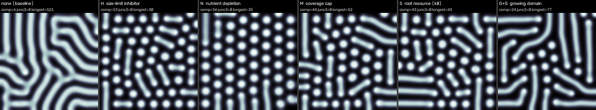
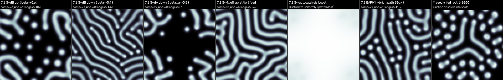

# 分岐機構の設計と 128² プロトタイプ比較 — 「孤立 pit が有限長で止まり、先端が分岐して木になる」は 1 場追加で可能か

対象: Gray-Scott（`sweep_video.py` と同じ kernel / dt=1 / dA=1, dB=0.5）に **場を最大 1 つ・項を 1–2 個** 加えて、
(a) 孤立 stripe が有限長 L* で止まる、(b) 先端が分裂して木になる、(c) 密な場でなく孤立した木が並ぶ、を得られるかを検証した。
コード: ブランチ `cursor/branching-mechanism` の `src/branching_prototypes.py`。数値・画像の一次データ（全 run の表）は別途。代表画像: `images/branching-prototypes.png`。

**結論を先に**: (a)(c) は S 案（root 供給資源）で達成できる（L* が root からの距離で決まり、時間不変、全 pit が孤立）。
**(b) の先端分裂は、試した全案・全結合（約 60 run）で 0 回**。GS の worm 先端は線形安定で、GS に存在する分裂は
「広い前線の Turing 不安定」（labyrinth / coral の ring 前線）だけであり、spot から伸びた細い worm の先端は
(f,k) を局所にどう動かしても分裂しない。したがって **「1 場 + 1–2 項」の範囲で木は得られなかった**（理由は §4）。枠外の 3 段階（S 依存拡散・活性化子側結合・BARW ハイブリッド）も §7 で追試したが木は出ず、GS には有限静止の Y 字が存在しないことを確認した。

## 1. 候補と「先端はなぜ自分の長さを知れるか」

ベース: A_t = ∇²A − AB² + f(1−A), B_t = 0.5∇²B + AB² − (k+f)B。

| 案 | 追加式 | 結合 | 先端が長さを知る理由（1 文） | 追加コスト |
|---|---|---|---|---|
| **H** 質量制限インヒビター | H_t = d_H∇²H + δ(ρB − H) | k_eff = k + γH | 幹全体が出す遅く広がる H の雲の中に先端があり、雲の濃さ ∝ 幹の質量（√(d_H/δ) ≥ L*）。 | 1 場, 2 項(+結合 1) |
| **N** 栄養枯渇 | N_t = d_N∇²N + ρ(1−N) − κBN | f_eff = f(1 − c(1−N)) | 幹が食べ尽くした周囲の栄養は √(d_N/ρ) の範囲で薄く、長い幹の先端ほど飢える（H の枯渇版）。 | 1 場, 2 項(+結合 1) |
| **M** 被覆キャップ | なし | k_eff = k + γ max(0, ⟨B⟩ − φ*) | 先端は自分の長さは知らず、場全体の被覆だけを知る（全 pit が伸びると同時に凍結）。 | 0 場, 1 項 |
| **S** root 供給資源 | S_t = ∇·(d_S χ(B) ∇S) + ρ·root − δS, χ=min(1,B/0.25), root=B(t_on)>0.3 | k_eff = k + κ(1 − g), g = S/(S + s₀·ρ/δ) | S は pit の口（root）から B のチャネルに沿ってだけ漏れ出し減衰するので、先端の S は exp(−L/ℓ_S), ℓ_S=√(d_S/δ) で root 距離を直接読む。 | 1 場, 3 項(+結合 1) |
| **G** 成長ドメイン | 格子を線形に拡大（全場を再補間） | なし | 長さは知らない。空間が増えることで自己複製・伸長の余地を与える補助（単独では埋まる）。 | 0 場, 幾何操作 1 |

S の結合バリエーション（先端分裂を狙ったもの）: `react`（反応 AB² を g で減らす）, `feed`（飢餓域で f を上げ先端を太らせる）,
`fedwide`（root 側で f を上げ広い基部を作る）, `widen`（半飢餓域 g≈0.5 で k を下げる）。いずれも `s_mode` で組合せ可。

## 2. プロトコル

- **dense**: リポジトリ初期条件 → (0.026,0.061) で 3000 step（Type I spots, ≈45 個/128²）→ 機構 ON（S の root = その時の spots）→
  4000 step で (0.036,0.059) へ ramp → 30000 step 保持。longest の時間不変性は t=18428 と 30000 の比較。
- **G**: 64² で開始し t=3000→23000 で 128² まで拡大（pit 間隔 ≈18→36 px、木のための余地を与える）。
- **iso**（孤立 blob）は GS では blob が ring になって root を離れるため S 系で破綻（全滅または直線）。孤立性の検証は G で代替。
- **sweep**: `SCHEDULE_V2` / `NOISE_SCHEDULE_V2` に埋め込み（60000 step）。S の強度を w(s) で変調（§5）。

## 3. 比較表（128², 最終 t=30000, 括弧は t=18428）

| 案（代表 run） | (a) 有限長: longest, 不変? | (b) 分岐: junc3 / trees | (c) 孤立性: comp（root≈45） | 見た目 |
|---|---|---|---|---|
| none | 521 (605) ✗ | 8 / 3（融合由来） | 6 ✗ | 密 labyrinth |
| H γ=0.02 | 30 (26) ○ | 0 / 0 | 53 ○ | 短 worm 場（一様 (f,k) シフトと等価。γ=0.04 で spots に戻る） |
| N c=0.3 | 35 (42) ○ | 0 / 0 | 56 ○ | 短 worm 場（c=0.5 で spots） |
| M γ=0.4 | 52 (50) ○ | 0 / 0 | 44 ○ | 短 worm 場（γ=0.2 では 103, comp 23 と融合が始まる） |
| **S kill κ=0.004, ℓ_S=14/20/31** | **34/43/57 (34/37/55) ◎** | 0 / 0 | **46/43/40 ◎** | 全 pit が孤立した有限 worm。**L* ≈ 2.4 ℓ_S** で制御可能 |
| S + feed/fedwide/widen | 189–628 | 1–8 / 1–3 | 5–12 ✗ | 先端が太っても分裂せず伸長→隣と融合（junc3 は融合の T） |
| S coral 目標 (0.050,0.062) κ=0.002 | 87 | 0 / 0 | 42 | coral 域でも spot 起源 worm は分裂しない |
| G のみ | 1146 ✗ | 8 / 1 | 1 ✗ | 自己複製で埋まる |
| **G + S κ=0.004** | **77 (70) ○** | 0 / 0 | **24 (18) ○** | 疎に並ぶ孤立有限 worm（曲がる・分岐なし） |
| G + H / N / M | 107 / 57 / 129 | 0 / 0 | 16 / 37 / 10 | 分岐なし |
| G + S + feed/widen | 118 / 123 | 0 / 0 | 11 / 41 | 分岐なし |

時系列画像は別途。

## 4. なぜ先端分裂が出ないか（結論の根拠）

1. **GS の worm 先端は安定な局在解**。先端速度は局所曲率と近傍場だけで決まり、(f,k) を上げれば「止まる／縮む」、下げれば「伸びる」の 1 自由度しかない。
   停止（k↑）と分裂（前線幅↑）は同じ軸の反対側にあり、局所 (f,k) シフト（kill / feed / widen の全組合せ）では両立しない。
2. **GS の Y 分岐は前線不安定由来**。coral (0.050–0.055, 0.062) で単一 blob から junc3≈9 の木状 labyrinth が出るのは、blob が ring（広い平面前線）になり
   それが指状に割れるからで、root を離れる ring 形成そのものが「pit の口が固定」という前提と矛盾する。dense / G で spot から伸びる worm は先端が細く、coral 域でも分裂しない。
3. **密度の幾何制約**。Type I の spot 間隔（≈18 px/128²）は stripe 幅の 3 倍程度で、L* を間隔/2 以上にすると隣と融合する（junc3>0 の run は全て comp が急減）。
   G で間隔を 2 倍にしても 1 は変わらない。
4. H/N/M が作る「短 worm 場」は S と見た目が似るが、長さは局所密度・全体被覆で決まる一様シフトであり、疎な場（G）では長さが伸びる（H 107, M 129 vs S 77）。
   「root からの距離で止まる」性質は S だけが持つ。

## 5. 推奨と sweep への組み込み

**推奨: S（root 供給資源, kill 結合）**を「有限長で止まる孤立 pit」の機構として採用。木（Y）は本枠組みでは出ないと明記する。

    S_t = ∇·(d_S χ(B) ∇S) + ρ·root(x) − δ S,   χ = min(1, B/0.25),  root = [B(x, t_on) > 0.3]
    k_eff = k + w(s) κ (1 − g),  g = S / (S + s₀ ρ/δ)
    推奨値: d_S = 0.2（陽解法安定条件 4d_S ≤ 1）, δ = 5×10⁻⁴ (ℓ_S = 20 px, L* ≈ 43 px/128²), ρ = 0.05, s₀ = 0.2, κ = 0.004

- t_on = Type I dwell 終端（s=0 の spots が root。spots 相では root=pit なので g≈1 で機構は自動的に不活性）。
- w(s) = clip((0.9 − s)/(0.9 − 0.7), 0, 1)（s≤0.7 で 1、s=0.9 で 0 の単調減少）。sweep 検証（図は別途）:
  spots (s=0) ○、s=0.66 は **comp 42・longest 58 の孤立有限 worm 場**（none では comp 6・longest 501 の labyrinth）、holes (s=0.94) ○（euler −0.97, none と同一）。
  w を切らない（always on）と holes が成立しない（B が root から遠い所で飢える）ので、holes 相前に w→0 は必須。
- 課題: s=0.40 の Type III dwell で κ が強く働き spots に留まる（longest 1–18）。dwell を s≈0.45 に動かすか、w(s) を s<0.3 で 0 から立ち上げる（w が非単調になる）調整が要る。
- 4 相の見え方は「spots → (短 worm) → **孤立有限 worm 場** → holes」となり、IV branching の枝分かれは失われる（現行 v2 の labyrinth より Kudo IV-branching から遠ざかる可能性あり）。

**簡潔さのコスト**: 場 +1（S）、S 方程式 3 項（チャネル拡散・root 源・減衰）、結合 1 項（k_eff）、パラメータ +5（d_S, ρ, δ, s₀, κ）+ w(s) の 2 点（s_on, s_off）。
root マスクという静的な入力（Type I spots の位置）を持つ点が「均質・自律な RD」からの最大の逸脱。

## 6. 木を本当に出すには（初版の枠外選択肢メモ；§7 で追試済み）

- 先端分裂を起こす別の不安定性を入れる: B の拡散を S 依存にする（飢餓域で d_B↑ → 先端が扁平化）や、3 変数系（先端で活性化する第 2 自己触媒）。いずれも「1–2 項」を超える。
- BARW 型の確率的先端規則（先端を粒子として分岐確率 p_b、S でゲート）を RD の上に重ねる: 連続体ではなくハイブリッドになる。
- 「木」の解釈を **root 側からの複数腕（星型）**に緩め、root を広い blob として f を上げる（fedwide）— dense では融合、G では分裂せず伸長で不成立だった。

## 7. 枠外選択肢の追試（案 B にコミットする前提での 3 段階） — 結論: この方向では木は出ない

一次データ（v2〜v4 の run 表・画像）は別途。代表画像: `images/branching-prototypes-v2.png`

（木が出た run は無いので、左から 7.1 → 7.2 → 7.3 → Y 安定性テストの順）。プロトコルは §2 の G（64²→128², 周期境界に変更）。

### 7.0 追試の前に判明した S の実装上の注意（結論に影響）

- **チャネル漏れ**: χ=min(1,B/0.25) では GS の背景 B（0.02–0.08）が 10–30% 導通し、S が場全体に染み出す（sweep 検証や §3 の S 結果はこの漏れ込み）。
  Hill 型 χ=B⁴/(B⁴+0.15⁴) に替えると選択性は出るが、密な場では隣のストライプまで 5 px 程度なので結局 S は場全体に行き渡る。
- **予算か定供給か**: 源 ρ·root − δS（総量 ρ·A_root/δ で保存）では、B 面積が増えると S が希釈されて一様に g が下がる。すなわち §3 の (a) は「距離で止まる」より
  「**root あたりの資源予算（質量上限）で止まる**」寄りで、H の per-pit 版に近い。root で S を定値に固定（Dirichlet）すると距離依存になるが、密な場では上記の理由で飢餓が起きず有限長が消える（`v2_S_dirichlet_selective_k4`: longest 200–300）。
- **飢餓域の定義**: g は B の外で必ず 0 なので、pit 自身の縁が「飢餓組織」に見える。拡散結合には (1−g)·min(1,B/b_ref) の組織重みが必要（無いと縁の d_B↑で spot が即死: `v2_S_dBup05_calib` 以前の run）。

### 7.1 S 依存の B / A 拡散（先端扁平化・Mullins–Sekerka）

    d_B,eff = d_B (1 + β_B (1−g) w_B),  d_A,eff = d_A (1 + β_A (1−g) w_B),  w_B = min(1, B/0.25)
    実装: 9 点ステンシルの保存形 ∇·(D∇u)（D=const で KERNEL と一致）。安定条件 max D ≤ 1 → d_B(1+β_B) ≤ 1。

| run (G, κ=0.004, ℓ_S=20) | comp | junc3 / trees / max junc per tree | longest | 結果 |
|---|---|---|---|---|
| G+S kill のみ | 15 | 0 / 0 / 0 | 148 | 曲がる有限 worm |
| β_B=+0.3 / +0.6 / +1.0 | 29 / 23 / 11 | 0 / 1 / 0 | 91 / 100 / 75 | 先端が鈍く太るが分裂せず**後退・断片化**（cov 0.37→0.18） |
| β_B=−0.4 | 27 | 0 | 140 | 先端が細くなり spot をちぎる（自己複製 spot 化） |
| β_A=−0.5 | 19 | 0 | 81 | 縮退（A 供給不足） |
| β_A=+0.4 (d_A=0.7,d_B=0.35 基準) | 17 | 1 / 1 / 1 | 482 | 長い worm、融合の T が 1 |
| β_B=+1.0 かつ β_A=+0.4 | 28 | 0 | 133 | 分岐なし |

d_B↑は「扁平化」でなく「局在解の消失」（dB/dA→1 で Turing 条件を失う）として働き、先端は止まる／縮む。d_B↓は spot のちぎれ（BARW でいう budding だが、娘 spot は幹と切れる）。
横方向不安定は一度も観測されず、junc3>0 は全て隣接 worm との融合（comp 減少を伴う）。

### 7.2 S を活性化子側に作用させる変種

    feed:  f_eff = f + φ(1−g)                （飢餓で供給↑ → 先端が太る）
    boost: A B² (1 + α(1−g))                  （飢餓で自己触媒↑）
    cubic: A B² (1 + c(1−g) B)                （飢餓で高次項）
    react: A B² (1 − (1−g_min)(1−g)) g_min=0.8（飢餓で自己触媒↓）

| run | comp | junc3 / trees | longest | 結果 |
|---|---|---|---|---|
| feed φ=0.010 / 0.020 | 10 / 8 | 5 / 3, 2 / 2 | 267 / 497 | 太くなり伸びて融合 → labyrinth（Y は融合由来） |
| boost α=0.5 / 1.0, cubic c=2 / 4 | 0 | – | – | B が一様に飽和（パターン消失） |
| react g_min=0.8 | 17 | 0 | 42 | 縮小 |

活性化子側は「太る＝伸びて融合」「強める＝一様化」「弱める＝縮む」の三択で、先端分裂の窓はなかった。

### 7.3 BARW 型ハイブリッド（最小構成 1 本）

    先端粒子 (y, x, θ): 速度 v=0.03 px/step で前進（角度ノイズ σ=0.02）、半径 2 px に B=max(B,0.5), A=min(A,0.3) を沈着。
    分岐: 確率 p_b·g_tip / step（不応期 200 step）、開き角 ±0.6 rad。停止: g_tip < g_stop または経路長 > L_max。
    RD 側: GS + S(kill κ=0.004) が幅と（本来は）停止を担当。root は Type I spots、tips は 2 本/root、G 成長後 (t=23000) に生成。

| run | tips 挙動 | 最終 comp / junc3 / max junc per tree | 結果 |
|---|---|---|---|
| S ゲートのみ（予算 S） | 生成直後に全滅（g<g_stop） | 37 / 0 / 0 | 分岐前に停止 |
| S ゲートのみ（Dirichlet S） | 飢餓せず増殖（births 1300–4000, 上限 300 本張り付き） | 16–26 / 8–12 / 5 | 点の沈着で場が埋まる（`v3_hybrid_G_dirichlet_late`） |
| 経路長 30 px で停止 + p_b=0.003 | 24 本 → 30 回分岐 → 1000 step で全停止（世代 ≤3） | 27 / 1 / 1 | **沈着した Y は RD に消される**: 腕は spot に千切れるか worm に吸収され、t=24142 の時点で junc3=0 |

粒子側は木を描けるが、GS はそれを保持しない。決定打として **Y 字そのものの安定性テスト**（v4 系列）: 3 腕 22 px の Y を初期値に置くと、
(f,k) を (0.028–0.055, 0.059–0.0625) で走査しても、root 給餌（S Dirichlet/予算, κ=0.004–0.010）を付けても、**有限で静止する Y は一つも無い** —
低 k 側では labyrinth に成長して場を埋め（junc3 9–19 は空間充填の副産物）、高 k 側では 1000 step 以内に spot に千切れて自己複製する。
つまり GS には「孤立した 3 分岐」という局所安定構造が存在せず、分岐を作る／保持するどちらの側からも木は成立しない。

### 7.4 判定と代償

- **junc3>0 の本物の分裂（comp が減らない分裂）: 0 件**（7.1–7.3 で新たに約 70 run）。
- 代償（もし採用した場合）: 7.1 は S に加えて拡散係数 2 個の結合（+2 パラメータ、保存形ステンシルへの変更）。7.2 は +1 項 +1 パラメータ。
  7.3 は連続体でなくなり、粒子状態（位置・角度・世代・経路長）と 7 パラメータ（v, p_b, Δθ, σ, g_stop, L_max, 不応期）を持ち込む。いずれも「1 場 + 1–2 項」を超え、かつ木は出ない。
- **結論: GS 系の細い worm 先端は線形安定で、Y 字は有限静止解として存在しない。この方向（GS + 局所結合 / ハイブリッド）では木は出ない。**

### 7.5 非 GS 系での見立て（1 パラメータで compact → finger → 分岐木 → 反転）

- **Laplacian growth / DLA・DBM（η パラメータ）**: η を上げると compact（Eden）→ 指状 → 分岐木（DLA）へ一気通貫で移る既知の系。「反転（背景が図になる）」は η だけでは出ず、
  多核成長で木同士が接触・合体して背景を島に切り分ける段階（被覆 → Euler 数反転）を「時間」で追加する必要がある。停止は成長量（ノイズ/流束の総量）で自然に有限。有望度: 高。
- **相場デンドライト（過冷却度 Δ + 異方性 ε）**: Δ を上げると平坦 → 細胞状 → デンドライト（側枝）と遷移し、先端分裂・側枝生成が本質的に入っている。潜熱枯渇で成長が止まるので有限長も自然。
  1 パラメータ路で反転相を出すには、多核の衝突・合体まで進める必要があり、Type I の「孤立丸い pit」は初期核の段階として表現できる。有望度: 中〜高（計算コストは GS より重い）。
- **粘性フィンガリング（Saffman–Taylor, 粘性比 / 毛管数 Ca）**: Ca を上げると平坦前線 → 指 → 先端分裂の木。ただし前線が一方向に進む系で、点状の孤立 pit（Type I）と背景反転が不自然。有望度: 低〜中。
- 共通の注意: これらは「界面が資源勾配を読む」非局所（Laplace 場）系なので、GS で不可能だった「先端が根からの距離を知る」が場そのものに内蔵される。反転相は 4 相目として
  「木の合体 → 島化」で自然に出るので、GS の holes（Turing 反転）とは機構が異なる点を設計書で明示すべき。
