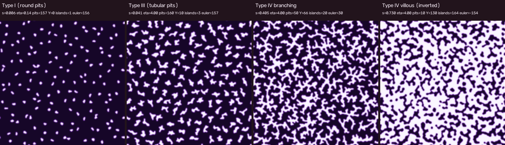
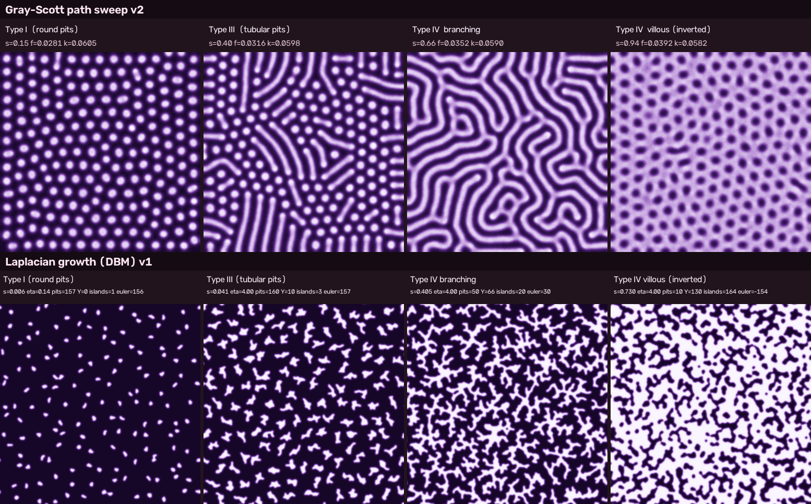

# DBM v1: Laplacian growth pit model の見た目改善と初回動画

対象コード: `src/laplacian_pit.py`（ブランチ `cursor/laplacian-growth-prototype` → main）。前段の報告: [`laplacian-growth-feasibility.md`](laplacian-growth-feasibility.md)。実験記録（全 run の表・JSON・ログ）は別途。

成果物:

- 動画 `pit-dbm-v1.mp4`（45 s, 30 fps, 768×864。容量のためリポジトリには含めない。`make dbm-video` で再生成）
- 4 相代表フレーム `images/pit-dbm-v1-phases.png`
- GS v2 との上下比較 `images/gs-v2-vs-dbm-v1.png`

## 1. 何を変えたか

| 項目 | 前段（feasibility） | v1 | 目的 |
|---|---|---|---|
| 核 | spacing 48 → 30 核 / 256² | **spacing 22 → 156 核**、うち **30 核だけが活性**（max-min 距離で等間隔に選ぶ）。残りは s=0.04 で成長停止、s∈[0.04, 0.12] で最も凸な境界セルから退縮して消える（`--n-active --dorm-s --dorm-fade`）。活性木に触れた休眠 pit は木に吸収 | Type I の密度と IV-B の木の大きさを両立 |
| η | 3 固定 | **η=0 を s<0.006 で保持**（等方成長で真円）、s=0.02 までに η=4 へ線形（`--eta-hold --eta-ramp`） | Type I の真円度 |
| ℓ（栄養遮蔽長） | 32 | **12** | 密核では ℓ が大きいと φ が一様になり管が出ない。ℓ ≲ 12 で先端不安定が核自身の形で決まり短管が出る |
| 枝幅 r_w | 1.0（幅 4.4 px） | **1.5 → 2.25**（s≥0.4 で線形、`--r-w-end --ramp-start`）幅 4.9 → 7 px | 形態学 opening で幅 3.7 px の枝が断片化したため太くした。villous で溝を太らせ細い隙間を埋める |
| 表面張力代理 β, β_r | 4, 2 | β=3、**β_r 2 → 5**（s≥0.4） | 後半は大きな半径で「細い隙間」を優先的に埋め、島を残す |
| 界面曲率フロー | なし | **s≥0.6 で有効**（`--flow-s 0.6 --flow-rate 0.1 --flow-delta 0.15 --flow-r 3`）: 半径 3 の pit 率が 0.35 未満の凸な pit 境界セルを毎ステップ 10% 除去、0.65 超の凹な空きセルを 10% 充填 | 島（背景）側の曲率ペナルティ。島の丸め・薄片の除去 |
| 境界平滑化 | Gaussian σ=1 → 0.5 閾値 | + **形態学 closing → opening（半径 `--morph-r` 1 px、表示は 3 倍解像度で半径 3）**。指標は平滑化前（`raw_*`）と後を両方記録 | 確率成長のギザギザを pit 半幅で丸める |
| 配色 | pit 暗・地明 | **GS v2 と同じクリスタルバイオレット LUT（pit 明・地暗）** | 統一 |
| 動画 | なし | `video` サブコマンド: 単調 s(t) を折れ線 knots で指定（水平区間 = 滞留）、3 フレームごとに骨格指標 → 自動相判定（単調・ヒステリシス 3 回）、字幕に相・s・η・r_w・pit 数・Y・島数・euler・進行バー。`sheet` で保存状態から 4 相パネルを再構成、`compare` で GS と上下比較 | 初回動画 |

採用パラメータ（`make dbm-video`）: 256², spacing 22, jitter 0.35, r0 2, r_w 1.5→2.25, ℓ 12, β 3, β_r 2→5, η 0→4（hold 0.006, ramp 0.014）, 活性核 30, 休眠 s 0.04 fade 0.08, フロー s≥0.6 rate 0.1 δ 0.15 r 3, mass_max 1900 px/核, seed 11。

## 2. 各相の指標（改善前 → 後、GS v2）

指標はすべて 256² 格子解像度（GS はパネルを 256² に縮小して同じ関数）。v1 の値は動画の代表フレーム（`pit-dbm-v1.json` の `rep_frames`）、平滑化後 / 平滑化前（raw）。

| 相 | 版 | s | cov | pit 数 n_fg | Y / X / strict | 端点 | 島 n_bg | euler | 木 | gen_max (mean) | 幅 mean / cv | 島面積中央値 |
|---|---|---|---|---|---|---|---|---|---|---|---|---|
| I | 前 | 0.008 | 0.017 | 31 | 0/0/0 | 14 | 1 | +30 | 0 | 1 | 3.6 / 0.34 | – |
| I | **v1** | 0.0065 | 0.06 | **157** (raw 158) | 0/0/0 | 40 (raw 56) | 1 | +156 | 0 | 1 | 4.1 / **0.18** (raw 0.16) | – |
| I | GS v2 | 0.15 | 0.29 | 216 | 0/0/0 | 12 | 1 | +215 | 0 | 1 | 9.2 / 0.15 | – |
| III | 前 | 0.04 | 0.036 | 31 | 0/1/0 | 48 | 1 | +30 | 0 | 1 | 4.2 / 0.35 | – |
| III | **v1** | 0.041 | 0.21 | **160** (raw 163) | 10/1/0 (raw 11/3) | 291 (raw 287) | 3 | +157 | 9 | 3 (1.07) | 4.8 / 0.25 | – |
| III | GS v2 | 0.40 | 0.38 | 178 | 0/0/0 | 104 | 1 | +177 | 0 | 1 | 7.0 / 0.15 | – |
| IV-B | 前 | 0.40 | 0.265 | 48 | 39/31/1 | 200 | 7 | +41 | 23 | 4 (2.0) | 4.4 / 0.36 | 26 |
| IV-B | **v1** | 0.405 | 0.376 | 50 (raw 51) | **66/39/4** (raw 67/42) | 258 (raw 278) | 20 (raw 15) | +30 (raw +36) | **28** | **8 (2.28)** | 4.9 / 0.28 (raw 4.5 / 0.27) | 35 (raw 47) |
| IV-B | GS v2 | 0.66 | 0.506 | 10 | 35/3/10 | 34 | 38 | −28 | 6 | 1 | 7.6 / 0.12 | 549 |
| IV-V | 前 | 0.85 | 0.577 | 25 | 97/62/5 | 229 | 128 | −103 | 9 | 17 | 5.6 / 0.39 | 33 |
| IV-V | **v1** | 0.73 | 0.661 | 10 (raw 12) | 130/67/13 (raw 107/58) | 101 (raw 147) | **164** (raw 113) | **−154** (raw −101) | 2 | 15 (3.5) | 7.3 / 0.38 | **54** (raw 73) |
| IV-V | GS v2 | 0.94 | 0.711 | 1 | 185/72/48 | 4 | 215 | −214 | 1 | 1 | 9.1 / 0.17 | 94 |

相ごとの出来:

- **Type I（密度・真円度）: ○**。157 個の丸い点（幅 cv 0.18、s=0.003 では cv 0.13 / raw 0.08 の真円。前段 31 個・cv 0.34）。GS の 216 個・幅 9 px に対し点はやや小さく（幅 4.1 px）疎。η=0 保持 + 形態学平滑化が効いた。滞留の終わり（s≈0.007, η≈0.14）では輪郭がわずかに崩れ始める。
- **Type III: △→○**。160 個すべてが短い管・星形（端点 1.8 個/pit、Y 10 個は密な管がたまたま触れたもの）。GS の長く平行な管（Type IIIL 寄り）ではなく Kudo の Type II（asteroid）〜IIIS 寄りの絵。ℓ=12 にしないと塊のまま管が出なかった。
- **Type IV branching: ○（木は維持）**。活性 30 核から 28 本の独立した木（Y 66、X 39、世代 8、平均 2.3、euler +30）。前段（Y 39、木 23、gen 4）より分枝が多く世代も深い。ただし ℓ を小さくしたぶん側枝が多く「藪状」で、Kudo IV-B の「幹から数本」より密。幅 cv 0.28（前 0.36）と均一化。
- **Type IV villous: △**。反転は明確（euler −154、島 164、pit は 10 成分→ほぼ 1 網）。島の中央値面積は 33 → 54 px（raw 73 px; GS 94 px）へ 1.6–2.2 倍になったが、**形は丸くなく蛇行した「虫状」**。s をさらに進めると島は小さな点（s=0.955: 236 個、29 px、cov 0.85、実験記録の `dbm-v1-phases-run1-villous-s0.955.png`）になり丸みは増すが GS の密で均一な円形島にはならない。曲率フローは、強くすると（rate ≥ 0.2）反転前に粗大化して太い塊の迷路になり（実験記録 `v1-f-flow-strong.png`; これは GS の IV-B 迷路にむしろ似る）、弱くすると島の形はほとんど変わらない。

## 3. 動画の設定

- `make dbm-video` → `artifacts/pit-dbm/pit-dbm-v1.mp4`, `pit-dbm-v1-phases.png`, `pit-dbm-v1.json`（全フレーム指標）, `pit-dbm-v1.states.npz`（全フレームの pit 集合、`sheet` サブコマンドで再構成）。
- 45 s × 30 fps = 1350 フレーム、256² を 3 倍表示（768²）+ 字幕 96 px、libx264 crf 18。所要約 17 分（4 コア CPU）。
- s(t) の折れ線: `0:0, 0.08:0.006, 0.18:0.007, 0.28:0.04, 0.38:0.042, 0.60:0.40, 0.70:0.41, 0.90:0.72, 1:0.74`。各相で 4.5 s 滞留（滞留中も s がわずかに進むので成長は止まらず、絵は静止しない）。
- 相ラベル（自動）: `euler<0 かつ 島数 > 活性核/2` → villous; `Y ≥ 4 かつ Y ≥ 0.2·pit 数 かつ 木 ≥ 3` → branching; `骨格長/pit ≥ 4 px` → tubular; それ以外 round。単調（戻らない）、3 回連続一致で遷移。結果: I s∈[0, 0.020]（300 フレーム）、III [0.021, 0.118]（279）、IV-B [0.122, 0.504]（450）、IV-V [0.507, 0.74]（321）。
- ちらつき対策: pit 集合は単調に増える（休眠 pit の退縮は s∈[0.04, 0.12] のみ、フローは s≥0.6 で毎ステップ 10%）ので、先端の確率的ギザギザは**表示のみの平滑化**（Gaussian σ=1 → 閾値 → 3 倍解像度で closing/opening 半径 3 px → サブピクセルのソフトエッジ）で抑えた。時間平均は使っていない。目視では先端の 1 px 単位のゆらぎはほぼ見えない。

## 4. 残る弱点

1. **villous の島の形**: 蛇行島。DBM の溝は分枝の隙間なので、島を丸く均一にするには「溝の間隔を一定に保つ」機構（先端間の反発、あるいは島側の Turing 的な選択）が必要で、単純な曲率フローでは粗大化と反転の両立が難しい。候補: (a) 反転後に **島だけを** 円に向けて緩和する（島ごとの面積を保存する曲率フロー = 面積保存の Allen–Cahn）、(b) villous 区間だけ GS（Type I 相のパラメータ）に引き渡し、DBM の網を初期条件にする。
2. **IV-B の藪状**: ℓ=12 は Type III の管を出すのに必要だが IV-B では側枝が多い。ℓ を s とともに 12 → 32 に増やす（`ell_end` は未実装）と Kudo 的な「幹 + 少数の枝」に近づく見込み。
3. **Type III の管が短い・不揃い**: 端点 1.8/pit の星形〜短管。長い平行管（GS IIIL）は DBM では核間の遮蔽競合で出にくい。
4. **形態学 opening と細枝**: r_w=1.5 で断片化は解消（n_fg 50 vs raw 51）したが、r_w < 1.25 では opening が枝を切る。metrics は raw も併記しているので確認できる。
5. **相の自動判定の閾値はこの系専用**（Y/pit 0.2 など）。GS と共通の判定器ではない。
6. **計算時間**: 17 分/45 s 動画。SOR 24 反復 × 約 4000 ステップが支配的。multigrid か GPU で 10 倍は縮む。
