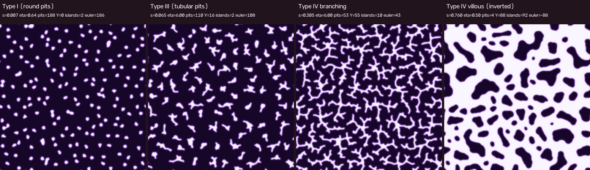
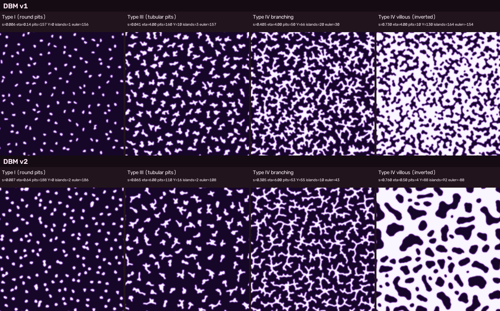
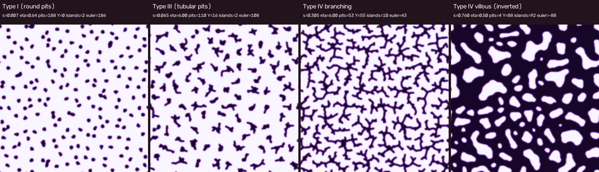

# DBM v2: 樹枝状の Type IV branching、丸い villous 島、200 個の Type I

対象コード: `src/laplacian_pit.py`（`make dbm-v2-video` / `dbm-v2-phases` / `dbm-v2-compare` / `dbm-v2-vs-real`）。前段: [DBM v1 報告](dbm-v1-report.md)。v1 の成果物・Makefile ターゲット（`dbm-video` など）はそのまま残している。

成果物:

- 動画 `pit-dbm-v2.mp4`（45 s, 30 fps, 768×864。容量のためリポジトリには含めず、Project Store の `media/` に置く。`make dbm-v2-video` で再生成）
- 4 相シート 
- v1 と v2 の比較（上 v1 / 下 v2） 
- 実画像との並置 `pit-dbm-v2-vs-real.png` は臨床画像（一部 CC BY-NC-ND）を含むため Store の `media/` のみ。下段に使った「pit を暗く」した極性反転版はここに置く: 

## 1. 変更点（モデル）

| 項目 | v1 | v2 | 狙い |
| --- | --- | --- | --- |
| 核の配置 | 六方格子 spacing 22 → 157 核, r0 = 2 | spacing 19.5 → **195 核**, r0 = 2.5 | Type I の密度と点径を GS 版（216 個, 9 px）に寄せる |
| 休眠 | 1 段（s = 0.04 で 30 本を残す, fade 0.08） | **2 段** `--stages 0.015:100,0.05:30`（fade 0.05） | Type I は 195 点、Type III は 100 本の長い管、Type IV は 30 本の木、と相ごとに個体数を変える |
| 遮蔽長 ℓ | 12 固定 | **12 → 40** を s ∈ [0.05, 0.3] で線形（`--ell-end/--ell-s0/--ell-s1`） | 木の間隔を広げ、遠くの隙間を先端に感じさせる（IV-B の枝間隔・villous の島サイズ） |
| 成長ノイズ | なし（noise_m = 1） | **noise reduction m = 4**（同じ格子点が 4 回選ばれてから付着） | 側枝の芽を抑え、幹と長い腕を作る（藪 → 樹枝） |
| η | 0 → 4 | 0 → **6**（Type III/IV-B）→ **0.5**（s ∈ [0.4, 0.7] で線形, `--eta-late`, `--ramp-end`） | 高 η で管を細長く・木を樹枝状に、villous では η→0（Eden 的一様肥厚）で網を均一に太らせる |
| 島の丸め | 全体の多数決フロー（s ≥ 0.6） | **面積保存の島側曲率フロー**（s ≥ 0.5, `_island_flow`）。全体フローは使わない | 島ごとに「凸な島セルを埋める」と「島に食い込む pit セルを削る」を同数ペアで行い、面積を保ったまま周長を減らす。2 つの島を隔てる pit セルは削らない（島の融合なし） |
| 予算 | 核ごとの質量予算 | 同じ（`global_s` のプール予算は試したが不採用、§4） | |
| 解法 | 9 点 SOR 24 反復 / step, 全周の 25 % を成長候補 | `cv2.filter2D` による 9 点近傍和、**16 反復**, **50 %** | 1 step あたり 3× 高速 |

追加した指標（`topo_metrics`）: `ep_per_100sk`（骨格 100 px あたりの端点 = 側枝密度）、`arm_len_mean` / `arm_ge8_frac`（Y 分岐の腕長の平均と 8 px 以上の割合）、`island_area_cv`（島面積の変動係数）、`island_circ_med`（島の真円度 4πA/P² の中央値。周期境界で切れた島は除外）。

## 2. 指標 v1 → v2（動画の代表フレーム、いずれも表示用平滑化後の図で計測）

| 相 | 指標 | v1 | v2 | 備考 |
| --- | --- | --- | --- | --- |
| Type I | 点数 / 幅 / 幅 CV | 157 / 4.1 px / 0.18 | **188** / **5.3 px** / 0.25 | GS 版 216 個・9 px。目標 200 前後に到達（195 核のうち周期境界で結合したものが減る） |
| Type III | pit 数 / 端点 / 端点/pit | 160 / 291 / 1.8 | **110** / 212 / **1.9** | 端点/pit は変わらないが、管 1 本の長さは 2 倍以上（質量 95 px, 幅 4.6 px → 長さ ≈ 20 px）。Y = 16（一部の管が二又） |
| Type IV-B | 木 / Y / X / 厳格 Y | 28 / 66 / 39 / 4 | 28 / 55 / 36 / **5** | |
| | 腕長平均 / 腕 ≥ 8 px 割合 | 6.7 px / 0.31 | **8.1 px** / **0.43** | 目標「腕長 ≥ 8〜10 px の Y が数世代」 |
| | 世代（核からの BFS） | 最大 8 | 最大 5, 平均 2.1 | 幹がはっきりした分、木 1 本あたりの Y は減った |
| | 側枝密度（端点/100 骨格 px） | 5.6 | 5.6 | 骨格ベースの側枝密度は不変（§4） |
| | 幅 / 被覆率 | 4.9 px / 0.38 | **4.2 px** / 0.28 | 細い枝、暗い間質が多い |
| Type IV-V | 島数 / Euler | 164 / −154 | 92 / −88 | |
| | 島面積中央値 / CV | 54 px / 1.44 | **180 px** / **0.96** | 目標 90 px 前後を超えて 2 倍。CV は 1/3 低下 |
| | 島の真円度（中央値） | 0.67 | **0.78** | 静的テスト（v1 の villous 状態に島フローのみ）でも 0.67 → 0.79 |
| | pit 網の幅 / 被覆率 | 7.3 px / 0.66 | 13.5 px / 0.68 | |
| 計算時間 | 45 s 動画 | 17 分 | **30 分** | 1 step は 3× 速いが noise reduction m = 4 で step 数が約 4 倍、villous の η→0.5 で候補点が増える（§4） |

## 3. 実画像との定性比較（`media/pit-dbm-v2-vs-real.png`, 上段は臨床 CV 染色画像）

染色像では pit が暗く粘膜面が明るいので、並置の下段は極性を反転（`--polarity pit-dark`）している。

- **Type I**: 密で丸い点。実画像（Katsurahara 2020）の均一な円形 pit に近い。点の大きさのばらつき（幅 CV 0.25）は実画像よりやや大きい。
- **Type IIIL**: 実画像（Futakuchi 2026）は長い管が平行気味に並ぶ。v2 は細長い管 110 本（長さ 15〜25 px）で v1 の「短い星形」より管らしいが、向きはランダムで、一部は二又・三又に割れる。
- **Type IV branching**: 実画像（Nakamura 2015）は溝が脳回状に太く蛇行する。v2 は細い樹枝状で、幹 → 腕 8 px 前後の Y が数世代と「木」としては読めるが、線が細く、脳回状の太い溝には見えない。GS v2 の迷路状との中間を狙うなら幅を上げる必要がある。
- **Type IV villous**: 実画像（Ohki 2022）は明るい絨毛（島）が 30〜60 % を占め、間の溝は細い。v2 の島は丸く均一になったが、島（絨毛側）が 32 %、pit 網が 68 % と、溝が太すぎる。島の形も円より豆形・楕円が多い。

## 4. 走査で分かったこと（詳細な表は Store の `internal/laplacian-prototypes/v2/sweep-table.md`）

1. **ℓ だけでは藪は直らない。** ℓ_end ∈ {12, 24, 40, 64}（a_L*）で、s = 0.3〜0.4 の側枝密度 5.4〜6.2 /100 px、腕長 6.1〜6.5 px、腕 ≥ 8 px 割合 0.24〜0.30 はほぼ不変。ℓ を上げると木の間隔と島面積（s = 0.2 で 32 → 146 px）は広がるが、枝の生え方は変わらない。
2. **表面張力を強くすると団子になる。** β = 5, β_r = 3（b_B3/B4）は側枝を減らす代わりに枝が太い葉状の塊になり、樹枝状にならない。
3. **noise reduction が効く。** m = 3〜4（b_B2, c_C1）で幹がはっきりし、腕長 7〜8 px、腕 ≥ 8 px 割合 0.4 前後に上がる。m = 6〜8 はさらなる改善がなく遅くなるだけ。
4. **η_end = 6〜8 で Type III の管が細長くなる**（e_typeIII.png）。η = 4 だと 3〜4 本腕の星形になる。
5. **villous の不均一性は 2 種類ある。** (a) 島の形の不整: 面積保存の島フローで解決できる（真円度 0.55〜0.67 → 0.78〜0.84）。(b) 領域ごとの充填の差（ある領域は塊、別の領域は「数珠つなぎ」の細い網）: これは全体の多数決フロー（細い枝を数珠に分断する）と、η が高いまま太らせること（露出した先端にだけ質量が集まる）の合作で、v1 の設定（f_F*, g_G*）では消えない。核ごとの予算をプールする（`global_s`）とむしろ悪化（g_G1〜G4: 露出した領域だけ埋まる）。**η を villous 区間で 0.5 まで下げ、多数決フローを切る**（h_H1〜H4）と、s = 0.8 で島 ~100 個、面積中央値 95〜101 px、CV 1.1、真円度 0.80〜0.84 の一様な「豆」模様になる。
6. **島面積の分布は木の隙間の階層構造を引き継ぐ**（本質的な弱点）。DBM の反転相は「ランダムな樹枝網の補集合」で、島 = 網の目。網の目の大きさは分岐の世代ごとに階層的に分布するので、島フローで形は丸められても面積の CV は 1 前後より下がらない（GS では拡散長が 1 つの長さスケールを選ぶため均一になる）。CV を下げるには島を割る（大きな目に枝を伸ばす: η > 0 が必要）と島を丸める（η → 0 が必要）が競合するため、単一の η スケジュールでは両立が難しい。

## 5. 残る弱点

- villous で pit 網（溝）が太く（幅 13.5 px, 68 %）、実画像の「細い溝と大きな絨毛」と figure-ground の面積比が逆。r_w_end を下げると island フローの前に網が数珠状に切れるので、幅を保ちつつ被覆率を下げる別の方法（例: 反転後に島側を膨張させる表示処理）が必要。
- 島の形は豆形・楕円が主で、真円度 0.78 は GS 版の島には届かない。面積 CV ≈ 1 も本質的（§4-6）。
- Type IV-B は樹枝状になったが線が細く、実画像の脳回状の太い溝とは印象が異なる。枝幅を上げると（r_w 2 以上）Y 検出が減るので、表示側で太らせるか、幅と分岐を独立に制御する仕組みが要る。
- Type III の管の向きがランダム（実画像は平行気味）。異方性（優先方向のバイアス）を入れていない。
- 計算時間は 30 分/動画に増えた。noise reduction 下では 1 step の付着数が 1/m になるので、`grow_frac` を m 倍にするか、票の蓄積を場の更新なしで複数回回す実装にすれば 4× 程度戻せる見込み。
