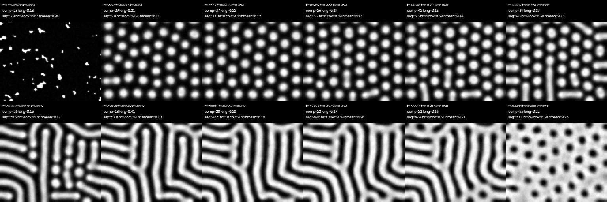

# pit pattern 4相の1パラメータ再現 — 実現可能性診断と方針提案

対象: リポジトリ（Gray-Scott 系 + Swift-Hohenberg 座屈モデル）。目標は Type I → III → IV branching → IV villous を「単純な1モデル・1パラメータ掃引」で出し動画化すること。本稿は実装せず、既存 docs/src の精読と小規模な追試（根拠データは別途）に基づいて判定する。

## (a) 現状の整理

**事実（コード・docs から）**

- 基本モデルは Gray-Scott（dA=1, dB=0.5, 3×3 カーネル, 陽的 Euler dt=1）。プリセットは I=(f,k)=(0.055,0.062)、III=(0.045,0.066)、IV=(0.033,0.056)。`grad.py`/`short.py` は画面横方向に (f,k) を線形補間する「空間掃引」を既に持つ。**時間掃引（1回の run 中にパラメータを動かす）は未実装**。
- `evaluate_pit_steps.py` には Step 0〜5 の 20 variant（飽和 q、cubic、芯減衰、空間 q_tip、不応 R、環境 C、インヒビター H、双安定 W、被覆 M、極性 P）と skeleton 指標がある。全 variant が **IV プリセット (0.033,0.056) を固定したまま項を追加** する設計で、掃引経路の設計は行われていない。
- 実測（seed=7, 160², 3500 step）: baseline `longest 0.83`（1枚の迷路）。B を弱める系（1c_a, H 単体, W+H）は `longest` を下げるが分岐も消え「迷路 ↔ 孤立片」の往復に留まる。1d（q_tip）は分岐 48 だが「時間とともに pit 間が橋渡しされ迷路化」と docs に記録。不応 R は全場適用で全滅、芯限定でも長さ上限は付かなかった。W 単体（`longest 0.33`, branch 26）が最良バランス。
- SH 座屈モデル（`simulate_pit_buckling.py`）は Type ごとに波長・r・g を **複数同時に** 変えた別 config であり、1パラメータ掃引ではない。
- docs の Type 対応は I/III/IV/VI であり、**「IV villous」も「図地反転」も一切扱われていない**。

**docs 側の診断（仮説）**: 「侵入フロントが空間を埋めるまで進む」「長さスケールが無い」「幅が (f,k) を吸収する」。本稿はこれらを概ね支持し、下で機構的に言い直す。

## (b) 壁の力学的な原因

1. **先端は自分の長さを知らない**。一様・自律・局所的な2変数反応拡散では、stripe 先端の前進速度は「パラメータ・局所曲率・遮蔽長 ℓ 以内の隣接構造」だけで決まる。A の遮蔽長は ℓ≈√(D_A/f)≈5 格子、B は ≈2.4 格子で、いずれも stripe 幅と同程度。長さ L ≫ ℓ の先端にとって L は不可視なので、固定パラメータでは v>0（crowding まで伸びる）／v<0（spot へ縮む）／v≈0（狭い臨界窓）の3択しかなく、**内在的な有限長 L\* は原理的に存在しない**。q・cubic・f・k を触ると v の符号が変わるだけ、というのが「迷路↔孤立片の往復」の正体。
2. **「止まる」と「分岐する」は両立しない要求**。先端分裂（Y 分岐）は先端が遅くなり平坦化して横方向不安定になるときに起きるが、分裂後の2先端は「若い」ので再び伸びる。固定パラメータで「止まった後に分岐して再び止まる」には、状態（年齢・資源）またはパラメータが時間変化する必要がある。
3. **不応 R が効かなかった理由**: R は B の滞在履歴として **先端の後方に** 蓄積し、動く先端自身は常に新鮮。年齢を先端に運ぶには「stripe に沿って輸送される資源」型の第3変数が要り、Euler 場モデルでは複雑化する。
4. **有限長 worm は crowding では安定に存在する（追試の事実）**。(f,k)=(0.034,0.060) では幅の 3–5 倍の worm が t=3000→8000 で粗大化せず維持された。つまり「有限長」は隣接構造の枯渇雲による間隔決定として得られ、docs の IV プリセットは maze 相の深部にあっただけ。
5. **幅の柔らかさ**（docs W メモ）は掃引でも再現され、f を上げると stripe が太る。動画の見栄えには効くが、4相の可否には本質的でない。

## (c) 候補アプローチ比較

| 候補 | 4相カバー | 単純さ | 実装難易度 | 動画化 | 所見 |
|---|---|---|---|---|---|
| A. GS 固定 IV 点 + 追加項（現行路線: H/W/R/q_tip…） | I○ III○ IV-B△ villous× | 低（4–7 場） | 済〜中 | 易 | 原理 1 により有限長は crowding 以上に出ない。収穫逓減 |
| **B. GS 1本の (f,k) 直線経路を時間掃引** | **I○ III○（dash/worm）IV-B○（ノイズ下）IV gyrus○ villous○（holes）** | **高（2 場・既存式のまま）** | 低 | **最適（掃引そのものが動画）** | 追試で 4 相を確認。dash 窓が狭く、stripes→holes にヒステリシス |
| C. SH 座屈 + g 掃引 | I○ III△ IV× villous○ | 高（1 場） | 済 | 易 | 変分系で直線 rolls になり Y 分岐・蛇行が出ない。掃引でも rolls が g=−1.1 まで残存 |
| D. 成長ドメイン上の Turing（Crampin ら） | III の分裂（crypt fission）○、他× | 中 | 中 | 易 | 相の進行は出ない。補助機構 |
| E. Ohta–Kawasaki / 相分離 + 平均組成掃引 | spots→labyrinth→反転 spots ○、branching△ | 高 | 中（スペクトル） | 易 | C と同型の変分系。GS より粗大化が強い |
| F. 分岐形態形成 BARW（Hannezo 2017） | IV-B ◎、I/III/villous × | 中（確率則） | 中 | 中 | 有限長「木」を出す専用機構。2段結合の候補 |
| G. 力学連成 / vertex / cell-based | 広い | 低 | 高 | 難 | 「単純な1モデル」から外れる |
| H. GS + 先端に運ばれる資源・年齢場 | 内在的 L\* ○ | 低 | 高・未検証 | 易 | 原理的には唯一の「内在的停止」。最後の手段 |

候補 B の追試で得た 4 相（spots / worm / labyrinth / holes）:

## (d) 実現可能性の判定と条件緩和

**反転対応の妥当性**: 「IV villous = Type I の図地反転」は、パターン形成の一般論（spots → stripes/labyrinth → inverted spots は2次項の符号や被覆率の連続変化で普遍的に現れる系列）と整合し、追試でも GS・SH 双方でホール相を確認した。形態学的にも、絨毛状腺腫の top view では上皮の絨毛先端（明るい島）を染色された溝＝pit（連結した網）が取り囲むので、「pit が図から地に変わる」解釈は自然である。ただし **臨床像の IV-V はしばしば脳回状（labyrinth 寄り）であり、完全な反転六方格子は理想化**である点、および IV-B/IV-V の細分がどの文献規約に基づくかは、ユーザー側でアトラス画像と照合してほしい（本稿の推測）。

**対応が成り立つ場合に残る問題**: 「有限長停止」だけではない。残るのは次の4点で、うち構造的障壁は 1 のみ。

1. 中間相の有限長: 内在的 L\* は不可能（原理 1）。ただし crowding 制限の有限 worm は安定相として存在し、掃引で dash 窓（Δf≈0.002–0.003）に **滞留（dwell）** させれば動画上「伸びて止まる」に見える。
2. 分岐: 無ノイズ掃引では Y 分岐がほぼ出ない（br 0–4）。弱いノイズ（σ≈0.003）で蛇行と分岐（br≈60）が出た。
3. ヒステリシス: k=0.060 一定では f=0.048 まで stripes が残りホールに移らない。k を下げる斜め経路 (0.026,0.061)→(0.040,0.058) なら終端でホール化。k=0.059 一定では一様 B への氾濫を経てから細かいホールになる。
4. 指標: 現行 `measure_pattern` は B 高側を図として二値化するため反転相で破綻する。オイラー数か B 平均 −0.5 の符号で「図地」を判定する指標が要る。

**判定**

- 「4相が固定値の安定相として現れ、各中間相の pit が孤立木として内在的長さで止まって分岐する」— **不可能と判断**（原理 1・2）。
- 「4相が1本の経路上の regime として現れ、遷移を 1 パラメータ s(t) の時間掃引で動画化する」— **可能**（追試で確認済み、既存 GS の式のまま）。

**緩和案（弱い順）**: (i) パラメータを「1つの値」から「1本の直線経路上の位置 s」に読み替える（実質は f と k の同時線形変化）。(ii) s を時間の関数にし、dash 窓で滞留する非一様スケジュールを許す。(iii) 有限長を crowding 制限として受け入れ、密に並んだ pit 場として描く。(iv) 孤立木の「伸びて止まって分岐」を絵として必須にするなら、GS（I/III/gyrus/villous）と BARW 等の分岐専用モデル（IV-B）の2段結合、または候補 H に踏み込む——単純さは大きく失われる。

## (e) 推奨方針と最小検証実験

**推奨 1（本命）: GS のまま、1本の (f,k) 経路の時間掃引**。式は現状の Gray-Scott から変えず、`(f,k)(s) = (0.026,0.061) + s·(0.014,−0.003)`（追試の経路）付近を出発点に、B へ弱い加法ノイズを入れる。動画は s(t) を単調増加させるだけで得られる。

最小実験（すべて既存関数で可。1本 128²×4 万 step ≈ 10 s）:

1. 経路の固定点走査: 経路上 s=0…1 を 12 点で固定し 8000 step、t=4000/8000 の comp・longest を比較。**合格条件**: spots／有限 worm（comp≥10、longest≤0.3 が時間不変）／labyrinth／holes（B 平均>0.5 で孤立暗点）が順に現れる。
2. 滞留付き掃引: dash 窓の s を推定し、その前後で dt あたりの ds を 1/5 に落とす（または一時停止）。**合格条件**: worm の平均長が 1 万 step 以上ほぼ一定で、その後の再加速で Y 分岐→連結→反転が同一 run 内で起きる。
3. ヒステリシス確認: 終端 s=1 で 1 万 step 追加しホールが安定か、経路の k 傾きを −0.002/−0.003/−0.004 で比較。
4. 図地判定指標の追加: 二値像のオイラー数（穴数−成分数）と B 平均で相ラベル {spots, worm, labyrinth, holes} を自動付与し、動画字幕に使う。

**推奨 2（保険）: SH 座屈モデル + g 掃引 + 空間ノイズ**。1変数で反転系列が最も綺麗に出るが、IV の蛇行・分岐を出すには g の空間不均一やノイズが必要で、掃引時の rolls 残存を解く必要がある。推奨 1 の実験 1 で worm 相が経路上に見つからない場合のみ着手する。

**やめてよい方向**: IV 固定点に H・R・cubic を積む路線。原理 1 により「内在的な有限長」は得られず、既に指標上も収穫逓減が明確。
