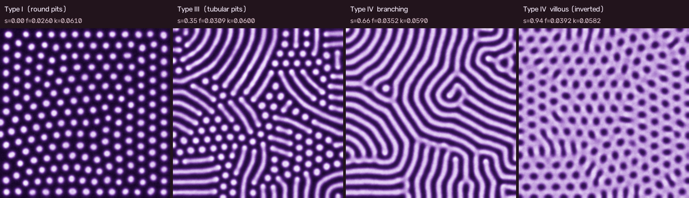

# GS 経路掃引による pit pattern 4相動画 v1 — 実験と設定のまとめ

成果物: 動画 `pit-sweep-v1.mp4`（768×864, 30 fps, 50 s, 1500 フレーム。容量のためリポジトリには含めない。`make sweep-video` で再生成できる）、代表フレーム [`images/pit-sweep-v1-phases.png`](images/pit-sweep-v1-phases.png)。実装は `src/sweep_video.py`（`make sweep-video`）。実験の生データ（run 表）は別途。

## モデルと経路

- Gray-Scott は既存のまま（dA=1, dB=0.5, `evaluate_pit_steps` と同じ 3×3 カーネル, Euler dt=1）。B に毎 step 加法ノイズ σ=0.003。
- 経路: `(f,k)(s) = (0.026, 0.061) + s·(0.014, −0.003)`、s∈[0, 0.94]。s=0.94 で (f,k)=(0.0392, 0.0582)。
- 格子 256², seed=7、総 120 000 step、80 step/フレーム。

## 滞留スケジュール s(t)（t は全長に対する割合）

| 区間 t | s | 内容 | 動画上の時刻 |
|---|---|---|---|
| 0.00–0.14 | 0 | Type I: hex spots 形成・滞留 | 0–7 s |
| 0.14–0.22 | 0→0.47 | 上昇 | 7–11 s |
| 0.22–0.24 | 0.47 | **overshoot**（格子が崩れ stripe が芽生える） | 11–12 s |
| 0.24–0.28 | 0.47→0.35 | **戻し** | 12–14 s |
| 0.28–0.50 | 0.35 | Type III: 短い worm/dash の滞留 | 14–25 s |
| 0.50–0.62 | 0.35→0.66 | worm が伸び連結して labyrinth | 25–31 s |
| 0.62–0.74 | 0.66 | Type IV branching 滞留 | 31–37 s |
| 0.74–0.84 | 0.66→0.94 | stripe が太り穴が抜ける | 37–42 s |
| 0.84–1.00 | 0.94 | Type IV villous（反転 hex ホール）滞留 | 42–50 s |

自動判定（Otsu 二値のオイラー数・成分の伸び・被覆率）による相の s 範囲: spots s∈[0, 0.47]（step 2000–27520）、worm s∈[0.35, 0.55]（27520–69360）、labyrinth s∈[0.55, 0.81]（69360–95440）、holes s∈[0.81, 0.94]（95440–120000）。

## 各相の出来

- **Type I**: 密な hex spots（256² で約 205 個、成分数・形状とも 20 000 step 以上不変）。良好。ただし実画像より整い過ぎる。
- **Type III**: 戻し先 s=0.35 で「短い dash（長軸 ≈24 px ≈ 幅の 3–4 倍）+ 丸い pit」の混合場になり、滞留後半（step 49 600–59 200、約 10 000 step）で明成分数 144、平均長 24–25 px が一定。滞留前半（33 600–49 600）は長い stripe が分断されて短くなる過渡。Y 分岐は無し（3 腕分岐 0、端点 106）。IIIL/IIIS 混在の見え方に近いが、一部に 100 px を超える stripe が残る。
- **Type IV branching**: s=0.66 で被覆 0.52 の labyrinth。オイラー数 −17〜−19。ただし stripe は格子方向を引き継いで平行〜蛇行が主で、**厳密な Y 分岐は 256² で 4–7 箇所と少ない**（端点 ≈50、先端が多い「指状」labyrinth）。「gyrus 様」ではあるが分岐の密度は実画像より低い。
- **Type IV villous**: s=0.94 で約 6 000 step 以内に完全な図地反転（暗成分 208 個、明被覆 0.72、1 枚の明地に丸い暗穴）。以後 20 000 step 安定。反転は明確に起きる。

## うまくいかなかった点・妥協

1. **単調な s(t) では Type III が出ない**。s=0 で出来る hex 格子が密で準安定なため、spots は固定点の worm 域（s≈0.30）を越えて s≈0.46 まで残る。そこで崩れた worm は既に長く（滞留中も伸び続け、平均長 19→49 px）、短い worm 場にならない。ゆっくり這わせると格子方向の平行 stripe ドメインになる。対策として **overshoot(0.47)→戻し(0.35)** の非単調スケジュール（「急冷して焼き戻す」）を採った。戻し先 0.30–0.32 では spots に戻り、0.33 は spots 側へ漂い、0.38 は長い stripe が残る。窓は Δs≈0.02 と狭い。
2. **Y 分岐が少ない**。ノイズを σ=0.006–0.012 に上げると worm は蛇行するが長くなり、σ=0.010 では Type III 滞留中に spots へ逆戻りする。σ=0.003 を採用し分岐密度は妥協した。
3. **終端のヒステリシス**。s=0.90 では stripe が残り完全反転しない（細長い穴が 20 000 step 残る）。s≥1.0 は一様 B に氾濫（固定点でも uniform）。s=0.94 が反転が速くかつ安定する唯一の窓（0.92 は反転に 25 000 step 要する）。
4. 既存指標 `measure_pattern` は 70 パーセンタイル二値化のため被覆 0.5 前後の labyrinth や反転相で分岐数が 0 になる。相判定は新規のオイラー数ベース指標で行い、Y 分岐数は Otsu 二値（反転相は暗相）を骨格化して別途数えた。

## 次の候補

- Type I の格子を少し乱す（初期揺らぎの空間スケールや seed 密度、弱い静的 (f,k) 不均一 = 既存 Step 2 の C 場）ことで単調な s(t) でも Type III へ落ちるか確認する。
- IV branching の分岐を増やす: labyrinth 区間のみノイズを強める時間依存 σ(t)、または k 傾きを変えた経路（B 経路は worm が長くなるので逆方向 −0.002 を試す）。
- Type III 滞留の前半の過渡（分断中）を短くするため、overshoot 保持を 2 400→1 600 step に減らす、あるいは戻しを 0.36 にして分断と伸長のバランス点を探る。
