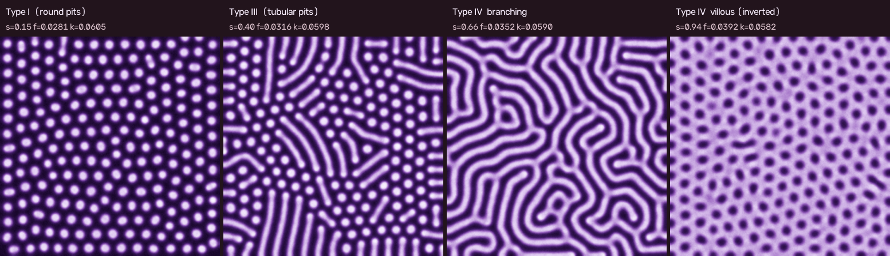
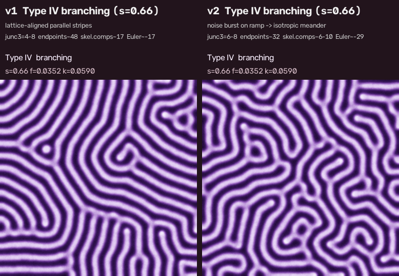

# Gray-Scott 経路掃引 v2: Type IV branching の改善と単調スケジュール化

対象コード: `src/sweep_video.py`（ブランチ `cursor/gs-path-sweep-video-58b1`）。v1 レポート: [`gs-sweep-v1-report.md`](gs-sweep-v1-report.md)。実験記録（exp6〜exp9）は別途。

成果物: 動画 `pit-sweep-v2.mp4`（50 s, 1500 フレーム。容量のためリポジトリには含めない。`--preset v2` で再生成できる）, `images/pit-sweep-v2-phases.png`, `images/pit-sweep-v1-vs-v2-branching.png`。



## 1. 何を変えたか

(f,k) 経路 A `(0.026,0.061) + s·(0.014,−0.003)` と物理定数は v1 のまま。変えたのは s(t) と、新設した σ(t)（ノイズ強度の時間スケジュール）だけ。

| 項目 | v1 | v2 |
|---|---|---|
| s(t) | `0→0.47 (overshoot) →0.35 滞留→0.66→0.94`（非単調） | `0 → 0.40 滞留 → 0.66 滞留 → 0.94 滞留`（**単調非減少**） |
| σ(t) | 0.003 一定 | Type I 区間 **0.010**、Type III 区間 0.003、**labyrinth へのランプ中だけ 0.020**（t=0.57–0.62）、以後 0.003 |
| 判定器 | r<−0.5 かつ n_bg≥6 で villous | 上記に加え **暗成分の縦横比中央値 < 1.6**（丸い島）を要求。太い labyrinth が villous と誤判定されなくなった |
| 字幕 | — | σ>0.012 の区間は `(transition: noise burst)` と表示（ノイズ支配の場に相分類は無意味なため） |
| CLI | `--schedule` | `--preset v1|v2`, `--noise-schedule "t:σ,..."`, `--init-smooth-sigma` を追加。v1 は `--preset v1` で再現可 |

v2 スケジュール（`SCHEDULE_V2` / `NOISE_SCHEDULE_V2`, total 120000 step）:

```
s : 0:0, 0.12:0, 0.24:0.40, 0.54:0.40, 0.64:0.66, 0.76:0.66, 0.85:0.94, 1:0.94
σ : 0:0.010, 0.12:0.010, 0.14:0.003, 0.54:0.003, 0.57:0.020, 0.62:0.020, 0.64:0.003, 1:0.003
```

### 1.1 優先 1: labyrinth 区間の分岐（exp6, exp9）

v1 の Type III 終端状態（step 60000）から 0.35→0.66 ランプ + 0.66 滞留（計 30000 step）を 15 通りの操作で流し、同一指標で比較した（`exp6_*`）。

| 操作 | 3 腕 Y 分岐 (strict) | 端点 | 骨格成分 | Euler | 所見 |
|---|---|---|---|---|---|
| v1 基準 σ=0.003 | 4–11 | 48–54 | 18–19 | −18 | 格子方向の平行 stripe |
| σ=0.008 一定 | 3–6 | 47–55 | 15 | −24 | 変化小 |
| σ=0.012 / 0.015 一定 | 3–11 | 41–51 | 14–15 | −21 / −57 | 等方的になるが粒状ノイズが残る |
| **σ=0.015–0.020 をランプ中のみ**（`nro015`, `nro020`） | 3–15 | 35–43 | 10–11 | −24 / −35 | **等方的な蛇行 labyrinth**、滞留で滑らかに戻る |
| s の往復 ±0.05/±0.06（周期 1500/4000 step） | 4–11 | 50–55 | 18–19 | −18 | 効果なし（先端分裂は起きない） |
| 0.66 へ急冷（jump） | 3–5 | 49–53 | 18 | −17 | 効果なし |
| 0.70/0.72/0.75/0.80 へ急冷 | 5–11 | 47–54 | 10–19 | −22〜−52 | 太い stripe になるだけ |
| 0.80 overshoot → 0.66 | 5–8 | 43–55 | 14 | −25 | 効果なし |
| k の傾き（窓の位置）を変える: (f,k) ∈ {0.033–0.042}×{0.0585–0.061} 9 点（`exp9_*`） | 2–14 | 26–61 | 5–30 | +25〜−40 | **どの点でも strict Y 分岐は 2–14 に留まる** |

結論: この GS 系（dB/dA=0.5, 3×3 カーネル）の labyrinth は、経路上のどこでも 3 腕 Y 分岐が 256² あたり 10 前後しかできない。s の往復・急冷・k の傾き変更では増えない。唯一「平行 stripe 場」を壊せたのは **ランプ中の強ノイズ burst**（σ=0.02, 約 6000 step）で、worm 場を一度崩して labyrinth を等方的に再核生成させる方式。滞留に入る前に σ を 0.003 に戻すと粒状感は数千 step で消える。

### 1.2 優先 2: Type I の乱れと単調スケジュール（exp7）

単調スケジュール `0→0.14:0→0.30:0.40→滞留`（66000 step）を、Type I 区間の σ とシードを変えて 6 realisation 流した（`exp7_*`）。

| 条件 | 滞留 30000 step 後 | 判定 |
|---|---|---|
| σ=0.003 一定, seed 11 | n_fg 111, len 33 px, asp 4.4 | worm（やや粗大化） |
| σ=0.003 一定, seed 2 / 3 | n_fg 160 / 114, len 21 / 32 px | worm |
| **σ_I=0.010 (t<0.14) → 0.003, seed 11 / 2 / 3** | **n_fg 149 / 159 / 155, len 23 / 22 / 22 px, asp 3.7 / 3.5 / 3.7** | worm、粗大化が遅い |
| 初期シードを密に（density 0.15, 平滑 1 px） | B が全面に広がり一様化 | 不合格 |

6/6 で **overshoot なしに s=0.40 直行で Type III（短い dash + spot の混合場）へ変換**した。v1 の実験 2（0.42 滞留で変換が遅かった）との差はランプ速度（10.6k step vs 20k step）と確率性による。Type I 区間の σ=0.010 は格子の秩序を完全には消せない（σ を下げると数千 step で hex に再整列し、worm もやはり格子行に沿う）が、Type III 滞留中の粗大化を抑える効果は 3/3 で再現した。**非単調スケジュールは不要になった**。ただし「格子方向の記憶が消えて優先 1 にも効く」という期待は外れ、labyrinth の等方化は 1.1 のノイズ burst に頼っている。

## 2. 指標の v1 → v2 比較（`exp8_compare_*`; 両者を同一コードで再計算）

Otsu 二値 → Zhang–Suen 細線化 → 枝刈り。`Y分岐(strict)` = 3 腕がそれぞれ ≥8 px の分岐クラスタ数（既存 `br` 指標と同じ判定基準、クラスタ数で集計）。`br(repo)` = `measure_pattern` の `branch_points`（70 パーセンタイル二値なので labyrinth ではほぼ 0 か不安定）。

| 相 | 版 | step / s | n_fg / n_bg | Euler | Y分岐(strict) | br(repo) | 端点 | 骨格成分 | 明 asp / 暗 asp |
|---|---|---|---|---|---|---|---|---|---|
| Type I | v1 | 14000 / 0.00 | 206 / 1 | +205 | 0 | 0 | 4 | 129 | 1.00 / – |
| Type I | v2 | 12000 / 0.00 | 175 / 1 | +174 | 0 | 0 | 34 | 90 | 1.11 / – |
| Type III | v1 | 58000 / 0.35 | 142 / 3 | +139 | 0 | 0 | 106 | 111 | 4.68 / – |
| Type III | v2 | 62000 / 0.40 | 168 / 1 | +167 | 0 | 0 | 107 | 121 | 3.29 / – |
| **IV branching** | **v1** | 80000–88000 / 0.66 | 18–19 / 35–37 | **−16〜−18** | **4–8** | 0–16 | **47–50** | **17–18** | 1.33 / 2.66 |
| **IV branching** | **v2** | 82000–90000 / 0.66 | 6–10 / 37–39 | **−27〜−33** | **6–8** | 4–30 | **31–33** | **6–10** | 1.00–1.14 / 2.43–2.59 |
| IV villous | v1 | 118000 / 0.94 | 1 / 208 | −207 | – | – | – | – | – / 1.1 |
| IV villous | v2 | 118000 / 0.94 | 1 / 220 | −219 | (明網の分岐 55) | 42 | 3 | 1 | – / 1.15 |

読み方:
- **Y 分岐数(strict)は 4–8 → 6–8 で、統計的に有意な増加ではない**（同一状態の 3 サンプル間でも 4〜11 と揺れる）。
- 代わりに **端点が 48 → 32、骨格成分が 17 → 6–10、Euler が −17 → −29** に変わった。すなわち「多数の平行 stripe が別々に走り、端が余る」場から、「少数の連結した蛇行 stripe がループを作る」場へ。**視覚的には格子方向の記憶が消え、脳回状の蛇行になった**。


- Type III は v1（0.35 滞留, n_fg 142, asp 4.7）より **短い dash が多く spot 混じり**（n_fg 168, asp 3.3）で、Kudo Type III の「小型管状 pit」に近い。ただし滞留 27000 step の間に n_fg 192→167 と緩やかに変換が進行中で、v1 のような完全定常ではない。
- 判定の切替わり（v2 最終 run）: forming→I @2000, I→III @37920 (s=0.400), III→transition @66720, transition→IV branching @75600 (s=0.634), IV branching→villous @103760 (s=0.940)。4 相すべて字幕付きで出現。

## 3. 残る弱点

1. **Y 分岐そのものは増えていない**。この GS パラメータ域（dB/dA=0.5）の labyrinth は本質的に「端点の多い蛇行 stripe」で、3 腕分岐は 256² あたり 10 前後が上限らしい（exp9: 経路近傍 9 点すべてで 2–14）。実画像の樹枝状（1 本の幹から次々に枝分かれ）に近づけるには、系そのものを変える必要がある（例: dB/dA を変えて stripe 先端分裂を起こす、あるいは空間的に不均一な (f,k) 場で局所的に villous 寄りの連結網を作る）。
2. **ノイズ burst は「物理」ではなく演出寄り**。labyrinth の等方化は worm 場を一度壊して再核生成させているので、Type III → IV branching が「連続的に伸びて分岐する」過程としては見えず、約 5 秒の粒状な遷移が挟まる。字幕でその区間を transition と明示している。
3. **Type III が完全定常でない**。0.40 滞留では 27000 step で n_fg 192→167 と変換が続く。もっと長く待てば v1 の 0.35 滞留（n_fg 144 で一定）に近い状態へ落ちる可能性はあるが未確認。dwell をさらに延ばすか、s を 0.40 で到達後に 0.38 へ僅かに下げる（単調性は崩れる）かが選択肢。
4. **確率性**: Type III への直行変換は 6/6 で成功したが、v1 の exp2（0.42 滞留、遅いランプ）では遅かった。シードやランプ速度を変えると失敗する realisation が出る可能性は残る。
5. **見た目の「整いすぎ」**（優先 3）には手を付けていない。Type I の hex 格子、villous の反転 hex 格子は依然として結晶的。Type I 区間の σ=0.010 は格子をわずかに乱すだけで、σ を下げると再整列する。
6. 動画ファイルサイズが 13 MB → 20 MB（ノイズ burst 区間が圧縮しにくい）。CRF を上げれば下がる。
