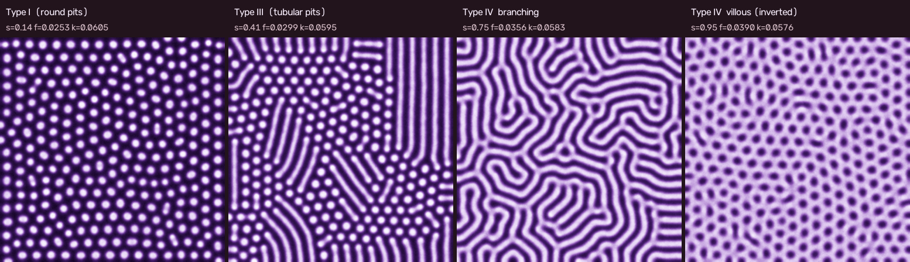
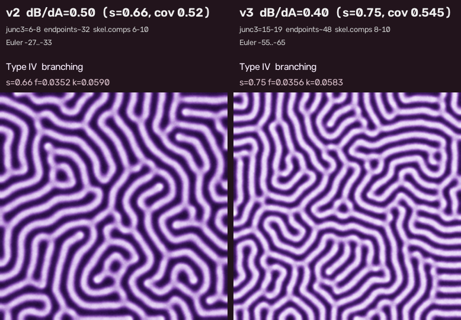

# Gray-Scott 経路掃引 v3-diffratio: 拡散比 dB/dA を変えて Type IV branching の Y 分岐は増えるか

対象コード: `src/sweep_video.py`（ブランチ `cursor/gs-path-sweep-video-58b1`、`--preset v3-diffratio`）。前段: [`gs-sweep-v1-report.md`](gs-sweep-v1-report.md), [`gs-sweep-v2-report.md`](gs-sweep-v2-report.md)。実験記録（exp10〜exp14）は別途。

成果物: 動画 `pit-sweep-v3-diffratio.mp4`（50 s, 1500 フレーム。容量のためリポジトリには含めない。`--preset v3-diffratio` で再生成できる）, `images/pit-sweep-v3-diffratio-phases.png`, `images/pit-sweep-v2-vs-v3-diffratio-branching.png`。



## 結論（先に）

- **dB/dA を 0.5 → 0.30〜0.45 に変えても、Y 分岐数（strict junc3）は「明確に」は増えない。** 被覆率をそろえた比較では dB/dA=0.35〜0.40 が 0.50 の約 1.4 倍（平均 18〜20 vs 13）だが、シード間のばらつき（±5）と同程度で、dB/dA=0.30 は逆に減る。
- **junc3 を支配しているのは拡散比ではなく labyrinth の明被覆率（＝経路上の位置 s）**。被覆率 0.52 → 0.55 で junc3 は 6–8 → 15–27 に増え、これは dB/dA=0.50 の v2 でも滞留 s を 0.66 → 0.72 に動かすだけで得られる（対照実験 exp14_control）。
- それでも要求どおり dB/dA=0.40 で経路・スケジュールを取り直した v3 を生成した。v3 の IV branching 滞留では junc3 15–19（v2 6–8）だが、上記のとおりその増分の大半は滞留被覆率 0.545 を選んだことによる。4 相は維持できた。

## 1. 走査結果

### 1.1 (f,k) 相図（exp10, 96², 6000 step, σ=0.003, ランダム初期値）

f∈[0.018, 0.050] step 0.002 × k∈[0.050, 0.066] step 0.001 を dB/dA ∈ {0.30, 0.35, 0.40, 0.45, 0.50} で走査（`exp10_phase_scan_db*.png/.csv`）。どの比でも f を上げると spots → worm → labyrinth → holes → uniform の順で、相図の**位相構造は同じ**。違いは:

| dB/dA | k=0.059 での f 境界 (sp/wo/la/ho) | 特徴 |
|---|---|---|
| 0.30 | ≤0.032 / 0.034–0.036 / 0.036–0.046 / ≥0.048 | 模様が細かい（波長短）。labyrinth 帯が f 方向に広い。低 k でも uniform にならない |
| 0.35 | ≤0.030 / 0.032–0.034 / 0.034–0.044 / ≥0.046 | |
| 0.40 | ≤0.028 / 0.028–0.030 / 0.032–0.042 / ≥0.044 | 境界が 0.50 より f で約 0.002–0.004 低い |
| 0.45 | ≤0.028 / 0.030 / 0.032–0.040 / ≥0.042 | |
| 0.50 | ≤0.030 / 0.030 / 0.032–0.040 / ≥0.042 | v2 経路 (0.026,0.061)→(0.040,0.058) |

### 1.2 labyrinth 相の Y 分岐（exp11, 256², ランダム初期値, 30000 step, k=0.059）

strict junc3（3 腕がそれぞれ ≥8 px の分岐クラスタ数、既存 `br` と同じ判定基準）。被覆率が近い行を比べる。

| dB/dA | f | 被覆率 | junc3 (seed 7 / 2 / 3) | 端点 | 骨格 px | junc3 / 1000 骨格 px | Euler |
|---|---|---|---|---|---|---|---|
| 0.30 | 0.040 | 0.517 | 4 | 54 | 6589 | 0.6 | −38 |
| 0.30 | 0.042 | 0.532 | 9 | 49 | 6711 | 1.3 | −58 |
| 0.30 | 0.044 | 0.547 | 6 | 31 | 6944 | 0.9 | −78 |
| 0.35 | 0.038 | 0.527 | 9 | 47 | 5562 | 1.6 | −50 |
| 0.35 | 0.040 | 0.541–0.550 | **13 / 24 / 23**（平均 20） | 36–38 | 5713–5776 | 2.3–4.2 | −69〜−72 |
| 0.40 | 0.036 | 0.522 | 12 | 42 | 5167 | 2.3 | −31 |
| 0.40 | 0.037 | 0.532 | 13 | 33 | 5305 | 2.5 | −55 |
| 0.40 | 0.038 | 0.548 | **19 / 13 / 22**（平均 18） | 27–41 | 5362–5481 | 2.4–4.0 | −53〜−66 |
| 0.45 | 0.036 | 0.527–0.531 | 11 / 14 / 11（平均 12） | 37–41 | 4649–4787 | 2.3–2.9 | −36〜−47 |
| 0.45 | 0.038 | 0.558 | 29 | 25 | 4944 | 5.9 | −70 |
| 0.50 | 0.034 | 0.507 | 10 | 44 | 4251 | 2.4 | −14 |
| 0.50 | 0.036 | 0.537–0.541 | **8 / 13 / 17**（平均 12.7） | 25–38 | 4439–4550 | 1.8–3.8 | −37〜−45 |
| 0.50 | 0.037 | 0.552 | 15 | 18 | 4646 | 3.2 | −58 |
| 0.50 | 0.038 | 0.596 | 37 | 15 | 5251 | 7.1 | −111（明相が 1 成分の網） |

読み方:
- どの比でも junc3 は被覆率とともに急増する（0.51 → 0.55 → 0.60 で ≈5 → 15 → 30）。被覆率 0.58 以上では明相が 1 つの連結網になり、暗相が細長い島（villous への途中）になる。
- 被覆率 0.54–0.55 で比べると **0.35–0.40 ≈ 18–20、0.45–0.50 ≈ 12–15、0.30 ≈ 6–9**。0.35–0.40 の増分は 1.4 倍程度で、シード間の幅（8–17, 13–22）と重なる。
- dB/dA を下げると模様が細かくなり骨格長が伸びる（0.30 で 1.5 倍）が、単位骨格長あたりの分岐密度は 0.30 が最低。細い stripe は分岐せず平行に走る。

## 2. 選んだ比と経路

dB/dA = **0.40**（0.35 と同等の junc3 で、他相の変化が小さい方）。経路の方向は v2 と同じ (Δf, Δk) ∝ (0.014, −0.003) のまま、境界の低 f 側シフトに合わせて始点を下げ、終点を延長:

```
v2 : (f,k)(s) = (0.026, 0.061) + s·(0.0140, −0.0030)
v3 : (f,k)(s) = (0.023, 0.061) + s·(0.0168, −0.0036)
```

固定点走査（exp12, 256², 12000 step）: s ≤0.33 spots、0.42–0.50 worm、0.58–0.83 labyrinth（被覆率 0.50 → 0.55 → 0.63、junc3 2 → 13 → 27）、≥0.92 holes（n_bg 292–323、被覆率 0.70–0.73、氾濫なし）。

スケジュール（`SCHEDULE_V3_DIFFRATIO` / `NOISE_SCHEDULE_V3_DIFFRATIO`, 120000 step, v2 と同じ「単調 s + ノイズ burst」方式）:

```
s : 0:0, 0.10:0, 0.20:0.41, 0.55:0.41, 0.65:0.75, 0.77:0.75, 0.86:0.95, 1:0.95
σ : 0:0.010, 0.10:0.010, 0.12:0.003, 0.55:0.003, 0.58:0.020, 0.63:0.020, 0.65:0.003, 1:0.003
```

Type III 滞留値の決め方（exp13, 格子からの直行, 66000 step）: s=0.36/0.38 → spots のまま、0.40 → 変換に 20000 step 以上かかる、**0.41 → 約 10000 step で短い worm（n_fg 246→150 or 239→213, asp ≈4）**、0.42 → 36000 step で n_fg 202→81 と長い worm に粗大化、0.46/0.50 → 直ちに長い worm。dB/dA=0.40 では短い worm の窓が v2（0.40）より狭い。

## 3. 指標の v2 → v3 比較（exp14; 同一コードで両プリセットを再計算）

| 相 | 版 | step / s | n_fg / n_bg | Euler | junc3 | br(repo) | 端点 | 骨格成分 | 骨格 px | 被覆率 | 明 asp / 暗 asp |
|---|---|---|---|---|---|---|---|---|---|---|---|
| Type I | v2 | 12000 / 0.00 | 175 / 1 | +174 | 0 | 0 | 34 | 90 | 183 | 0.256 | 1.11 / – |
| Type I | v3 | 10000 / 0.00 | **241** / 1 | +240 | 0 | 0 | 37 | 126 | 247 | 0.278 | 1.12 / – |
| Type III | v2 | 62000 / 0.40 | 168 / 1 | +167 | 0 | 0 | 107 | 121 | 1891 | 0.399 | 3.29 / – |
| Type III | v3 | 62000 / 0.41 | **202** / 3 | +199 | 0 | 0 | 105 | 139 | 2477 | 0.407 | 4.15 / – |
| **IV branching** | **v2** | 82000–90000 / 0.66 | 6–10 / 37–39 | −27〜−33 | **6–8** | 4–30 | 31–33 | 6–10 | 4350–4400 | 0.521–0.524 | 1.0–1.1 / 2.4–2.6 |
| **IV branching** | **v3** | 84000–92000 / 0.75 | 8–10 / 63–73 | −55〜−65 | **15–19** | 0–63 | 48–49 | 8–10 | 5270–5340 | 0.542–0.547 | 1.0 / 2.5–2.8 |
| 対照: v2 で滞留 s=0.70 | dB/dA=0.50 | 82000–90000 / 0.70 | 7 / 55–57 | −48〜−50 | 8–14 | – | 32–34 | 7 | 4500 | 0.541–0.544 | – / 2.1–2.5 |
| **対照: v2 で滞留 s=0.72** | dB/dA=0.50 | 82000–90000 / 0.72 | 5 / 52–55 | −47〜−50 | **17–27** | – | 23–26 | 5 | 4510–4550 | 0.539–0.550 | – / 3.0–3.2 |
| IV villous | v2 | 118000 / 0.94 | 1 / 220 | −219 | – | – | 3 | 1 | – | 0.730 | – / 1.15 |
| IV villous | v3 | 118000 / 0.95 | 1 / **302** | −301 | – | – | 5 | 1 | – | 0.710 | – / 1.18 |

- v3 の IV branching は junc3 15–19（v2 の 2.3 倍）、Euler −55〜−65、暗成分 63–73 個で、v2 より密で分岐の多い蛇行になった。


- **ただし対照実験**: dB/dA=0.50 の v2 のまま滞留 s を 0.72（被覆率 0.54–0.55、v3 と同じ）にすると junc3 17–27 と v3 以上になる。単位骨格長あたりでも対照 3.8–6.0 /kpx > v3 2.8–3.6 /kpx。**v3 の増分は拡散比ではなく滞留被覆率を上げたことで説明できる。**
- 判定の切替わり（v3 最終 run）: forming→I @2000, I→III @30320 (s=0.41), III→transition @67920, transition→IV branching @76800 (s=0.716), IV branching→villous @103440 (s=0.95)。4 相すべて字幕付きで出現。

## 4. 他の 3 相への副作用

- **Type I**: 波長が短くなり spot 数 175 → 241（間隔 ≈17 → ≈14 px）。格子はやはり hex に整列する。
- **Type III**: spot 数が多いぶん dash も多い（n_fg 202）が、asp 4.2 と v2（3.3）より長め。滞留中 n_fg 247 → 196 と緩やかに粗大化し続ける（v2 は 192 → 167）。短い worm の窓が狭い（s=0.40 では遅すぎ、0.42 では粗大化）ので、シードによっては変換の遅れや長い worm 化が起こりうる。
- **Type IV villous**: 穴の数 220 → 302 と細かくなり、被覆率 0.71（v2 0.73）。反転は s=0.95 で ≈4000 step で完了し 16000 step 安定。氾濫なし。
- 遷移の burst 区間（約 5 秒）は v2 と同じ。

## 5. 残る弱点

1. **拡散比では Y 分岐は明確に増えない**（本レポートの主結論）。分岐密度は被覆率で決まり、被覆率を上げると暗相が島になり villous 側へ寄る。「被覆率 0.5 のまま分岐が多い樹枝状」は dB/dA ∈ [0.30, 0.50] の GS では得られない。
2. v3 の見かけ上の改善（junc3 15–19）は v2 の滞留 s を 0.72 にするだけで再現できるため、**動画としては v2 の滞留位置調整で足りる**可能性が高い。v3 を採るなら「模様が細かくなる（同じ 256² に多くの pit が入る）」ことが主な利点。
3. dB/dA=0.40 では Type III の窓が狭く、滞留中に緩やかに粗大化する。長い滞留や別シードでは長い worm 化のリスクがある。
4. Type I / villous の hex 結晶性はそのまま（優先 3 未着手）。
5. 空間的な拡散の非等方性・(f,k) のゆらぎ（候補 2）は別ワーカー担当のため未実施。
