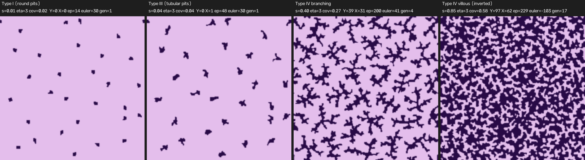

# Laplacian growth (DBM) による pit pattern 4 相再現 — 実現可能性プロトタイプ報告

対象コード: `src/laplacian_pit.py`（ブランチ `cursor/laplacian-growth-prototype`、main から分岐、commit `8e203d1`, `b933cc5`。PR は未作成）。
実験記録・グリッド・ログ（全 run の一覧）は別途。代表画像: `images/laplacian-prototype-phases.png`。
比較対象: GS 経路掃引 v2 のパネル `images/pit-sweep-v2-phases.png`（[`gs-sweep-v2-report.md`](gs-sweep-v2-report.md)）。

## 1. 結論（要約）

- **η 固定（η=3）・核ごとの成長量 s を唯一の単調パラメータ**として、Type I → III → IV branching → IV villous（図地反転）の 4 相が 1 本の経路上に出る。η を動かす必要はなかった（η ランプは Type I を真円にする代わりに「太い芯 + 細い枝」を作るので不採用）。
- **本物の Y 分岐**は出る: 256²・30 核で IV-B 相に Y=39（腕 4 本の X=31）、30 核中 23 が孤立した木、世代 gen_max=4（平均 2.0）。GS 版 IV-B（Y=35）と同程度の Y 数だが、GS は 1 つの迷路網に埋もれた Y であり、DBM は**独立した樹状体**として Y が出る点が質的に違う。
- **反転**は出る: s=0.85 で euler +41 → −103、暗成分（島）128 個、pit は 1 つの連結した溝網になる。ただし島は小さく（面積中央値 33 px、参照/GS の 94–550 px より小）、溝が太い（幅 5.6 px）ため villous らしさは GS 版より弱い。
- Type I は η 固定だと「やや不整な多角形の点」（真円ではない）。Type III は短管（骨格端点 ≈ 1.5/核、Y=0）が出る。
- 単純さ: 場は φ 1 枚、確率的成長のみ。256² で s=0→1 の全経路 145 s（約 4000 回の場解法、1 ステップ 10–35 ms）→ **256² 動画化は現実的**（ただし GS のように連続 PDE ではなく確率過程なので、フレーム間の「揺れ」はある）。

## 2. モデル

### 2.1 場（栄養/電位）

pit 集合 \(P\)（各セルが「どの核に属するか」のラベル）を境界 0 とする遮蔽 Poisson 場:

\[
\nabla^2 \phi - \frac{\phi - 1}{\ell^2} = 0 \quad (x \notin P),\qquad \phi = 0 \ (x \in P),
\]

周期境界。ℓ→∞ で純 Laplace（遠方 = 1）。ℓ は「間質の栄養供給距離」の代理。離散化は **9 点等方ステンシル**（辺 4・角 1・中心 −20、/6）で、4 色 Gauss–Seidel SOR（ω=1.8、1 ステップあたり 24 反復、初期 400 反復）。5 点ステンシル + red-black では正方格子異方性（軸に固定された十字）が出たため変更した。

### 2.2 成長（DBM, 核ごと）

各核 \(k\) の周囲セル（pit の 8 近傍の空きセル）\(x\) に重み

\[
w_k(x) = \left(\frac{\phi(x)}{\max_{x' \in \partial P_k} \phi(x')}\right)^{\eta} \cdot \rho(x)^{\beta},
\qquad \rho(x) = \text{半径 } \beta_r \text{ の円内での pit 率}
\]

を与え、**核ごとに 1 セルを抽選**して半径 \(r_w\) の円盤を刻印する。\(\rho^\beta\) は表面張力の代理（凹部を優先し、1 セル幅の毛羽を抑える）。核ごとの正規化により、遮蔽で飢えた核も同じ速さで成長する（→ 粒径の一様性。`--growth global` で全周囲一括抽選にすると木の大きさがばらつく）。

### 2.3 有限長（予算）と掃引パラメータ

核 \(k\) の pit 面積が \(M_k \ge s \cdot \text{mass\_max}\) になったら停止。**s ∈ [0,1] が経路パラメータ**。`--eta-end/--eta-ramp` で η を s に対し線形に動かすことも可能（実験 P2/P3/P5）。核の初期配置は六方格子 + ジッタ 0.35、初期半径 r0。

### 2.4 採用パラメータ（`final256c`）

| 記号 | 意味 | 値 |
|---|---|---|
| size | 領域 | 256²（周期） |
| spacing / jitter | 核間隔・乱れ | 48 px / 0.35 → 30 核 |
| r0 | 核初期半径 | 3 |
| r_w | 刻印半径（枝幅） | 1.0 → 実測幅 4.4 px |
| ℓ | 遮蔽長 | 32（16–64 で形態はほぼ不変） |
| η | DBM 指数 | 3（固定） |
| β, β_r | 表面張力代理 | 4, 2 |
| mass_max | 核あたり最大面積 | 1400 px（s=1 で被覆 ≈0.7） |
| SOR | ω / 反復 | 1.8 / 24 |

## 3. 指標

`laplacian_pit.topo_metrics`（GS 掃引実験で使った骨格指標と同系）。図 = pit（Gaussian σ=1 → 0.5 閾値 → 6 px 未満の穴埋め）。

- `junc3`（Y）: Zhang–Suen 骨格 → 4 px スパー刈り → 次数 ≥3 のクラスタを 3 px 未満の廊下で結合 → 腕が 3 本かつ各 ≥3 px。`junc4`（X）: 腕 4 本（近接した 2 つの Y）。`junc3_strict`: リポジトリ既存の厳格版（腕 ≥ size/32 = 8 px）。
- `endpoints`、`sk_comps`（骨格成分）、`n_fg / n_bg`（明/暗成分、8/4 連結）、`euler = n_fg − n_bg`、`trees`（Y を含む成分数）、`gen_max/gen_mean`（核 → 先端で通過する Y 数 + 1）、`width_mean/cv`（距離変換）、`island_area_med`（暗成分面積中央値）、`branch_angles`（Y の開き角）。
- GS 側は v2 パネル（明度 Otsu 二値）に同じ関数を適用（スクリプトと結果 JSON は別途）。

## 4. 4 相の可否（256², η=3 固定）

| 相 | s | cov | Y / X / strict | ep | sk_comps | n_fg / n_bg | euler | trees | gen_max (mean) | 幅 mean / cv | 島面積中央値 | 可否 |
|---|---|---|---|---|---|---|---|---|---|---|---|---|
| I 丸い pit | 0.008 | 0.017 | 0 / 0 / 0 | 14 | 13 | 31 / 1 | +30 | 0 | 1 | 3.6 / 0.34 | – | **△** 孤立点は出るが多角形的でやや不整。η ランプ 0→4 なら真円（P2/P3: ep 0–6） |
| III 短管 | 0.04 | 0.036 | 0 / 1 / 0 | 48 | 31 | 31 / 1 | +30 | 0 | 1 | 4.2 / 0.35 | – | **○** 各核が 1–2 本の短い管に伸びる、Y なし |
| IV 分枝 | 0.40 | 0.265 | **39 / 31 / 1** | 200 | 47 | 48 / 7 | +41 | **23** | **4 (2.0)** | 4.4 / 0.36 | 26 | **○** 独立した木が 23 本、本物の Y、世代 2–4。幅一様 |
| IV 絨毛（反転） | 0.85 | 0.577 | 97 / 62 / 5 | 229 | 23 | 25 / **128** | **−103** | 9 | 17 | 5.6 / 0.39 | **33** | **○/△** 反転は明確（euler<0、島 128、溝は 1 網）。島が小さく溝が太い |

補足（192² η×s グリッド。図は別途）:

- η=0 は全 s で丸い blob（Y=0、幅 13 px）→ Type I 専用。η=1 は塊 + 短腕。η=2–3 が世代 3 の木、η=4–6 は細管・Y 多数（s=0.5 で Y 49–50、gen 5–6）だが枝が毛羽立つ。
- 反転（euler<0）は η≥2 なら s≈0.7–1.0 で必ず起こる。ℓ=16/32/64 で形態はほぼ変わらない（spacing 48 では核間の遮蔽競合が支配的）。
- strict junc3 が低いのは腕が 8 px 未満で終わるため（枝長 ≈ spacing/2 ≈ 20 px に対し幅 4 px、世代が進むと腕は短い）。

### 現実感（定性）

- **幅の一様性**: 良い（cv 0.34–0.39）。r_w 固定で刻印するため枝の太さが揃い、Kudo IV-B の「均一幅の樹枝」に近い。η ランプ版は芯が太くなる（cv 0.47–0.49）。
- **分岐角**: Y の開き角中央値 89°（四分位 80–93°、n=22）。GS IV-B は 93°。ほぼ同じで、実物の 60–120° 範囲に入る。
- **密度**: 核 30/256² は実物 Type I（GS 版 ≈200 個/パネル）よりはるかに疎。核密度を上げると枝が伸びる前に融合するため、Type I の密度と IV-B の木の大きさは 1 つの核集合では両立しない（後述）。
- **島（villous）**: DBM の島は「木々の隙間」なので小さく不整形（33 px）。参照の villous は丸い大きな島（GS: 94 px）。
- 幅の工夫: r_w=0.5 は幅 3.8 px でほぼ変わらず骨格が断片化（不採用）。r_w=1.5 は幅 ≈6。核半径 r0 は Type I の大きさのみ支配。φ 閾値による事後の太らせは未使用（描画時の Gaussian σ=1 のみ）。

## 5. GS 版との比較（同一指標、v2 4 パネル）

| 相 | 手法 | cov | Y / X / strict | ep | sk_comps | n_fg / n_bg | euler | trees | gen_max | 幅 mean / cv | 島面積中央値 |
|---|---|---|---|---|---|---|---|---|---|---|---|
| I | GS v2 | 0.290 | 0 / 0 / 0 | 12 | 129 | **216** / 1 | +215 | 0 | 1 | 9.2 / 0.15 | – |
| I | DBM | 0.017 | 0 / 0 / 0 | 14 | 13 | 31 / 1 | +30 | 0 | 1 | 3.6 / 0.34 | – |
| III | GS v2 | 0.379 | 0 / 0 / 0 | 104 | 123 | 178 / 1 | +177 | 0 | 1 | 7.0 / 0.15 | – |
| III | DBM | 0.036 | 0 / 1 / 0 | 48 | 31 | 31 / 1 | +30 | 0 | 1 | 4.2 / 0.35 | – |
| IV-B | GS v2 | 0.506 | 35 / 3 / 10 | 34 | **10** | 10 / 38 | **−28** | 6 | 1 | 7.6 / 0.12 | 549 |
| IV-B | DBM | 0.265 | 39 / 31 / 1 | 200 | **47** | 48 / 7 | **+41** | **23** | **4** | 4.4 / 0.36 | 26 |
| IV-V | GS v2 | 0.711 | 185 / 72 / 48 | 4 | 1 | 1 / **215** | **−214** | 1 | 1 | 9.1 / 0.17 | **94** |
| IV-V | DBM | 0.577 | 97 / 62 / 5 | 229 | 23 | 25 / 128 | −103 | 9 | 17 | 5.6 / 0.39 | 33 |

読み方:

- **IV-B**: GS は Y=35 だが sk_comps=10、euler −28 —— すなわち Y は既に連結した迷路網の中にある（「分枝した迷路」）。DBM は euler +41、23 本の木が独立し gen_max 4 —— **Kudo IV-B（互いに独立な樹状 pit）に位相的に近い**。一方 GS の枝は太く幅 cv 0.12 で滑らか、DBM は幅 cv 0.36 でやや毛羽立つ。
- **I / III**: GS は密（216 個、幅 9 px、cv 0.15）で参照写真の密度に近い。DBM は疎（31 個）で輪郭がやや粗い。ここは GS が明確に優位。
- **IV-V**: GS は島 215 個・面積 94 px・ほぼ真円で参照に近い。DBM は反転するが島が小さく不整形で、端点 229 が残る（溝網に袋小路が多い）。GS 優位。
- 分岐角は両者 ≈90° で同等。

## 6. 単純さの評価

| 項目 | DBM (`laplacian_pit.py`) | GS (`sweep_video.py` v2) |
|---|---|---|
| 場 | φ 1 枚 + pit ラベル（整数） | u, v 2 枚（+ v2 では空間依存パラメータ場） |
| 経路パラメータ | s 1 個（η 固定） | s 1 個（F, k, D 等を同時に動かす） |
| 形態パラメータ | η, ℓ, β, β_r, r_w, r0, spacing, mass_max（実質効くのは η, spacing, r_w, β） | F, k, Du, Dv, 初期条件, スケジュール |
| 決定性 | 確率過程（seed 依存、フレーム間にノイズ） | 決定論的 PDE（滑らかに変化） |
| 1 ステップのコスト（256²） | 10–35 ms（SOR 24 反復 + 抽選 30 核）、1 経路 145 s | 数 ms/反復、1 経路 数十秒 |
| 実装量 | 約 770 行（指標・描画・CLI 込み。中核は 150 行程度） | 同程度 |
| 256² 動画化 | **可能**。s を毎フレーム進めて描画。60 s 動画なら 1800 フレームに約 4000 ステップを割り当てれば良い。ノイズによる先端の「ちらつき」は Gaussian 描画で軽減、必要なら σ を上げる。512² は SOR コストが 4–8 倍で 10–20 分 | 実績あり（GS 掃引 v1 動画） |

DBM は概念的に最も単純（「栄養勾配の急な所に伸びる」の 1 文）で、**「分枝 → 木 → 融合 → 反転」が 1 パラメータで出る**ことが確認できた。ただし Type I の密度・真円度と villous の島の大きさは GS 版のほうが参照に近い。

## 7. 残る課題

1. **Type I の密度と真円度**: 核 30/256² は疎。核を密にすると IV-B で木が育つ前に融合する。案: (a) Type I → III の間は核を多く置き、IV-B 移行時に一部の核を「休眠」させる（予算を核ごとに不均一にする）、(b) 初期 s∈[0,0.05] だけ η=0（真円）にし、その後 η=3 に飛ばす（P2/P3 の中間: ランプを短くして芯の太りを抑える）。
2. **villous の島**: 島を大きく丸くするには「溝の幅を一定に保ちつつ、島（間質）側に表面張力」を入れる必要がある。案: 反転後に pit 側でなく背景側の凸部を削る後処理、あるいは s>0.6 で r_w を下げる（`--r-w-end`、未検証）。
3. **strict Y が少ない**: 腕長が 8 px 未満。spacing を 64 以上にすると腕が伸びて strict Y は増える（gridA の η=3–4 で確認済みの傾向）が、核はさらに疎になる。
4. **確率過程のちらつき**: 動画化時にフレーム間で先端が揺れる。1 フレーム複数ステップ + σ=1 描画で実用上は許容範囲と見込むが、実際に mp4 を作って確認する必要がある。
5. **GS とのハイブリッド**: DBM の pit ラベル像を GS の初期条件・空間パラメータ場として渡す（DBM で位相、GS で輪郭を滑らかに）案は未検討。

## 8. 成果物

- コード: `src/laplacian_pit.py`（ブランチ `cursor/laplacian-growth-prototype`、push 済み、PR なし）。サブコマンド `grid`（η × s グリッド）、`path`（1 経路のスナップショット列）、`phases`（4 相ラベル付きパネル + 指標 JSON + 二値 npy）。
- 図: `images/laplacian-prototype-phases.png`（256², 4 パネル、Type I / III / IV-B / IV-V ラベル付き）。
- 実験ログ（全 run 表、再現コマンド、η 掃引グリッド、ℓ 感度、global 成長、経路 P1–P5、256² 経路、骨格デバッグ、全指標 JSON、GS 版への同一指標）は別途。
