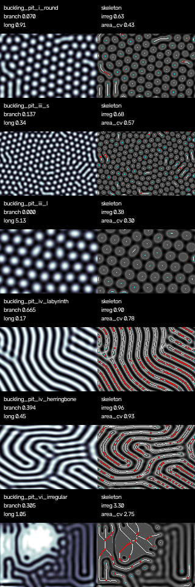

# 反応拡散以外のモデルで pit pattern を生み出せるか

結論から言うと **できる**。pit pattern（Kudo 分類が観察する大腸腺口の top-view 模様）は、反応拡散（Turing）機構だけでなく、既報の複数の「自然な」シミュレーションモデルで生成できる。むしろ大腸粘膜の形態形成では、化学的な反応拡散よりも **力学（座屈・成長）** と **細胞レベルの離散ダイナミクス** の寄与が大きいとする研究が多い。

このドキュメントは、反応拡散以外のモデル群を文献から整理し、そのうち最も pit pattern の全 Type をカバーできる **力学的座屈モデル** のプロトタイプ実装（`src/simulate_pit_buckling.py`）を示す。

医学的背景（Kudo 分類の各 Type）は `docs/pit_pattern_literature.md`、反応拡散モデルの評価は `docs/pit_model_evaluation.md` を参照。

## 1. 反応拡散以外の主なモデル群

### (A) 力学的座屈 / morphoelastic モデル（最有力）

増殖する上皮単層が弾性基質（stroma）や平滑筋に拘束されると圧縮応力が生じ、金属板の座屈と同様の不安定性で周期的な折れ・突起（villi / crypt）が生じる、という機構。

- Hannezo E, Prost J, Joanny JF. "Instabilities of Monolayered Epithelia: Shape and Structure of Villi and Crypts." *Phys. Rev. Lett.* 2011;107:078104.
  - 細胞分裂が生む負の表面張力が臨界に達すると有限波数で座屈。**大腸=crypt（丸い pit）**、**小腸=villi（finger / herringbone / labyrinth）** という相図を、圧力と「分裂-曲率結合」の 2 軸で再現する。これは pit の丸い配列から labyrinth・分岐まで、単一機構で連続的に説明する。
- Shyer AE, et al. "Villification: How the Gut Gets Its Villi." *Science* 2013;342:212–8.
  - 平滑筋層が順次分化して成長を拘束し、圧縮応力で「縦ひだ → zigzag → villi」と段階的に座屈する過程を実測と計算で示した。
- Ciarletta P, et al. "Morphoelastic control of gastro-intestinal organogenesis." *J. Mech. Phys. Solids* 2015. 消化管に沿った多様な折れ模様を morphoelasticity で説明。

pit pattern との対応: 座屈相図の「spots → stripes → labyrinth → 乱れ」は、Kudo の **Type I（丸）→ Type IV（分岐・脳回）→ Type VI（不整）** の形態進行にそのまま対応する。

### (B) 細胞ベース / エージェントベースモデル

上皮を離散的な細胞の集団として表現し、増殖・分化・機械的相互作用（バネ・接着・反発）から組織形態を創発させる。pit（腺口）は細胞集団の幾何配置として現れる。

- Meineke FA, et al. lattice-free crypt モデル（Voronoi 分割で細胞形状を表現）。
- Chaste（Cancer, Heart and Soft Tissue Environment）framework: cell-centre / vertex / Voronoi モデルで大腸 crypt を標準的にシミュレート。
- Fletcher AG, et al. "Vertex Models of Epithelial Morphogenesis." *Biophys J.* 2014. 細胞を多角形として表現し、皮膜張力・接着・面積弾性から上皮のパッキングと再配置を再現。
- Buske P, et al.（PLOS One 2013 ほか）: crypt の pedigree/niche 概念を単一細胞エージェントで比較。

pit pattern との対応: Voronoi パッキングは丸〜多角形の **Type I / II** の腺口モザイクを自然に与え、増殖率の空間的不均一を入れると腺口サイズ・配列の不整（**Type VI**）を作れる。ただし **Type IV の分岐（gyrus）** は点 Voronoi だけでは出しにくい。

### (C) 力学 + 移流拡散 の連成（pit pattern を直接対象にした既報）

- Figueiredo IN, et al. "Biomathematical model for simulating abnormal orifice patterns in colonic crypts." *Math. Biosci.* 2019.
  - 弾性/粘弾性の準静的力学モデルと、細胞動態の移流拡散モデルを連成。**異常増殖が生む圧力で腺口（orifice = pit）の形が変わる**過程を、大腸粘膜の top-view（内視鏡と同じ視点）で 2D シミュレートし、in vivo で観察される異常 pit pattern を再現する。
  - pit pattern の異常化を「機械力 × 細胞動態」で説明する、最も直接的な先行研究。ここで拡散は登場するが、パターンの起源は Turing 不安定ではなく増殖-圧力-変形の連成である。

### (D) その他の pattern 生成機構（参考）

- 表面 wrinkling / Swift–Hohenberg 型モデル: 弾性座屈の縮約（振幅）方程式。波長選択を伴う spots / stripes / labyrinth を生む。(A) の連続体縮約形として使える。
- 位相場（phase-field）モデル、DLA / Eden 成長など: 特定形態には使えるが pit pattern の全 Type を統一的に説明する枠組みではない。

## 2. まとめ: 各モデルの pit pattern 再現力

| モデル | 機構 | Type I/III（丸） | Type IV（分岐） | Type VI（不整） | 実装容易さ |
| --- | --- | --- | --- | --- | --- |
| 反応拡散 (Gray-Scott) | 化学的 Turing | ○ | △（線が伸びすぎ） | △ | 容易（既存） |
| 力学的座屈 (Hannezo) | 弾性不安定 | ◎ | ◎ | ○ | 容易（本実装） |
| 細胞ベース (Voronoi/vertex) | 離散細胞力学 | ◎ | △ | ◎ | 中〜重い |
| 力学+移流拡散 (Figueiredo) | 増殖-圧力連成 | ○ | ○ | ◎ | 重い |

力学的座屈モデルは、単一機構で Type I→IV→VI の形態進行を最も広くカバーし、numpy だけで軽量に実装できるため、本リポジトリのプロトタイプに採用した。

## 3. プロトタイプ実装: 力学的座屈モデル

`src/simulate_pit_buckling.py` は、反応拡散を使わずに pit pattern を生成する。

### 3.1 方程式

弾性基質上で増殖する上皮の座屈は、波長選択を伴う不安定性の縮約形である Swift–Hohenberg 方程式で表せる。

```text
du/dt = r u - (1 + laplacian / k0^2)^2 u + g u^2 - u^3
```

- `u`  : 上皮面の高さ（変位）。ピーク（peak）を pit 開口とみなす。
- `r`  : 増殖由来の圧縮応力（成長パラメータ）。大きいほど強く座屈。
- `k0` : 選択波数。crypt 間隔＝pit のサイズを決める（`wavelength = 2π/k0`）。
- `g`  : 2 次項。大きいと六方格子状の丸い spot（round pit）を選択、`g≈0` で stripe / labyrinth / 分岐を選択。
- `-u^3`: 飽和項。

演算子は化学拡散ではなく **弾性座屈** に由来する（正規化形 `(1 + ∇²/k0²)²` は一様モードを減衰させ、波数 `k0` の帯を選択する）。数値積分は線形項を Fourier 空間で陰的に、非線形項を実空間で陽的に扱う半陰的スペクトル法。

### 3.2 Type への対応（config）

| config | pit type | 主な設定 |
| --- | --- | --- |
| `buckling_pit_i_round` | Type I | 強い 2 次項で規則的な丸 pit |
| `buckling_pit_iii_s` | Type IIIs | 短波長で小さく密な丸 pit |
| `buckling_pit_iii_l` | Type IIIL | 長波長で大きい丸/管状 pit |
| `buckling_pit_iv_labyrinth` | Type IV | 2 次項ゼロで labyrinth・分岐 |
| `buckling_pit_iv_herringbone` | Type IV | 異方性で配向した脳回状の分岐 |
| `buckling_pit_vi_irregular` | Type VI | 成長と spot/stripe バイアスを空間的に不均一化し、複数 regime を共存 |

Type VI は「幾何模様を混ぜて描く」のではなく、**局所ごとに座屈 regime（丸 pit / stripe）が異なる状態**として表現する。この考え方は反応拡散版（`docs/pit_model_evaluation.md`）の Step 3 と同じ哲学に立つ。

### 3.3 評価指標の共有

反応拡散版の評価関数（`measure_pattern` など）を `src/evaluate_pit_steps.py` から import して再利用する。これにより、同一の二値化・skeleton・分岐/不整指標で **反応拡散モデルと力学モデルを同じ土俵で比較** できる。

### 3.4 実行例

```bash
python3 src/simulate_pit_buckling.py --output artifacts/pit_buckling
```

軽い確認:

```bash
python3 src/simulate_pit_buckling.py \
  --output artifacts/pit_buckling_smoke \
  --size 96 --steps 800 --snapshot-count 3
```

### 3.5 結果（size=160, steps=2500）

各 case の height field（左）と skeleton overlay（右）を縦に並べた `contact_sheet.png` を下に示す。



指標のまとめ（値は seed=7 の一例）:

| case | 連結成分数 | branch_density | longest_frac | area_cv | vi_irregularity |
| --- | --- | --- | --- | --- | --- |
| pit_i_round | 129 | 0.070 | 0.07 | 0.43 | 0.63 |
| pit_iii_s | 279 | 0.137 | 0.05 | 0.57 | 0.68 |
| pit_iii_l | 76 | 0.000 | 0.05 | 0.30 | 0.38 |
| pit_iv_labyrinth | 23 | 0.665 | 0.11 | 0.78 | 0.90 |
| pit_iv_herringbone | 20 | 0.394 | 0.18 | 0.93 | 0.96 |
| pit_vi_irregular | 27 | 0.305 | 0.33 | 2.75 | 3.30 |

読み取り:

- Type I / IIIs / IIIL では孤立した丸 pit が多数（成分数が多い）、分岐は少ない。
- Type IV（labyrinth / herringbone）では `branch_density` が最大化し、連結した分岐線が支配的になる。
- Type VI では `component_area_cv`（pit サイズのばらつき）と `vi_irregularity_score` が突出して大きく、複数 regime の共存＝不整を定量的に捉えられている。

すなわち、**反応拡散を使わない力学的座屈モデルでも、Kudo pit pattern の Type I → IV → VI の形態進行を再現できる**。

## 4. 注意点

- 本実装は座屈機構の縮約モデルであり、実際の組織弾性・平滑筋分化・細胞増殖を定量的に解いてはいない。あくまで「非反応拡散の自然な機構でも pit pattern が出る」ことを示すプロトタイプである。
- 医学的な Kudo Type の確定判定ではなく、形態 morphology の比較を目的とする点は反応拡散版と同じ。
- より生物学的に忠実にするなら、(B) の細胞ベースモデルや (C) の力学+移流拡散連成へ発展させる余地がある。

## 5. 主要参考文献

1. Hannezo E, Prost J, Joanny JF. Instabilities of Monolayered Epithelia: Shape and Structure of Villi and Crypts. *Phys Rev Lett* 2011;107:078104.
2. Shyer AE, Tallinen T, Nerurkar NL, et al. Villification: How the Gut Gets Its Villi. *Science* 2013;342:212–218.
3. Ciarletta P, Balbi V, Kuhl E. Morphoelastic control of gastro-intestinal organogenesis. *J Mech Phys Solids* 2015.
4. Figueiredo IN, et al. Biomathematical model for simulating abnormal orifice patterns in colonic crypts. *Math Biosci* 2019.
5. Fletcher AG, Osterfield M, Baker RE, Shvartsman SY. Vertex Models of Epithelial Morphogenesis. *Biophys J* 2014;106:2291–2304.
6. Swift J, Hohenberg PC. Hydrodynamic fluctuations at the convective instability. *Phys Rev A* 1977;15:319. （座屈/対流の波長選択縮約方程式）
